# Feather Feature Store Architecture

> A comprehensive guide to Feather's internal architecture for developers and operators.

## Table of Contents

- [System Overview](#system-overview)
- [High-Level Architecture](#high-level-architecture)
- [Core Components](#core-components)
  - [Storage Layer](#storage-layer)
  - [Serving Layer](#serving-layer)
  - [Ingestion Layer](#ingestion-layer)
  - [Aggregation Engine](#aggregation-engine)
- [Data Flow](#data-flow)
- [Concurrency Model](#concurrency-model)
- [Observability](#observability)
- [Extension Points](#extension-points)
- [Performance Characteristics](#performance-characteristics)
- [Deployment Patterns](#deployment-patterns)

---

## System Overview

Feather is a high-performance, real-time feature store designed for machine learning applications. It provides **sub-millisecond P99 latency** for feature retrieval through a sophisticated multi-tier architecture optimized for serving ML features at scale.

### Key Design Principles

| Principle | Implementation |
|-----------|----------------|
| **Low Latency** | Two-tier storage with in-memory hot cache (256 shards) |
| **High Throughput** | Lock-free atomic counters, sharded access patterns |
| **Durability** | BadgerDB-backed warm tier with historical versioning |
| **Observability** | Prometheus metrics, OpenTelemetry tracing, structured logging |
| **Resilience** | Circuit breakers, graceful degradation, health probes |

---

## High-Level Architecture

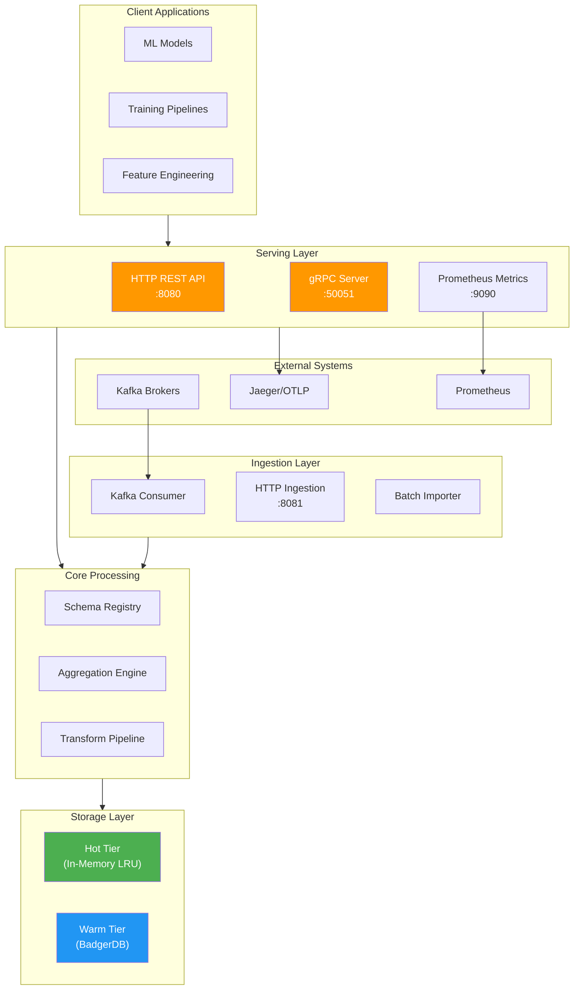

---

## Core Components

### Storage Layer

The storage layer implements a **two-tier hybrid architecture** optimized for both latency and durability.

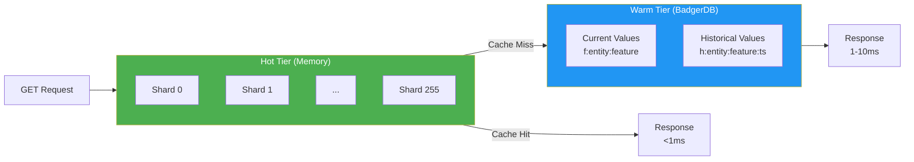

#### Hot Tier Architecture

The hot tier provides sub-millisecond access through an in-memory sharded LRU cache.

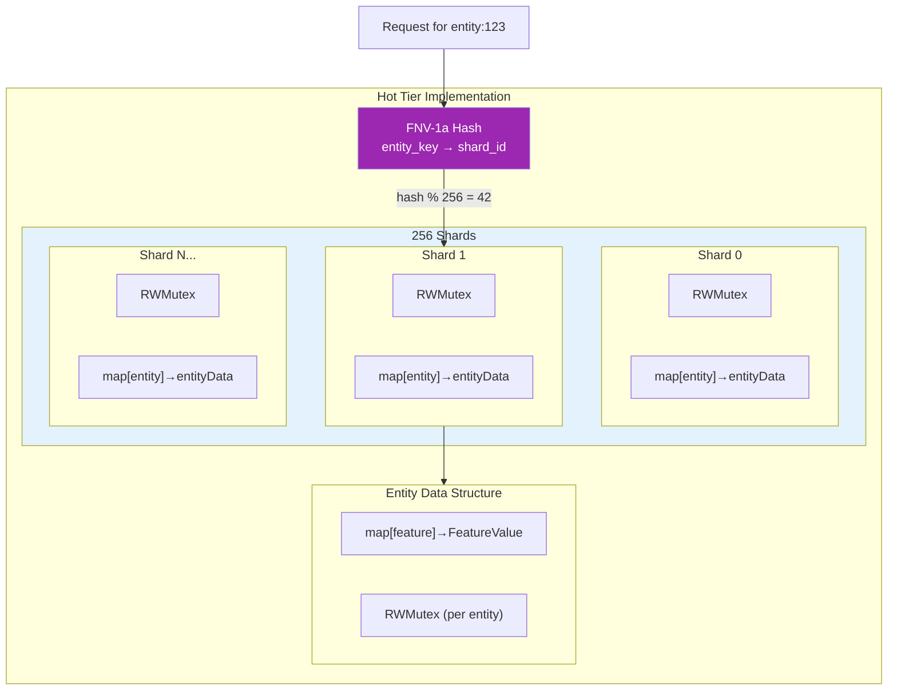

**Key Implementation Details:**

| Component | Implementation | Purpose |
|-----------|---------------|---------|
| **Sharding** | 256 shards with FNV-1a hash | Reduces lock contention |
| **Locking** | RWMutex per shard + per entity | Fine-grained concurrency |
| **Metrics** | Atomic counters (lock-free) | Zero-cost observability |
| **Memory Tracking** | Approximate size (~100 bytes/value) | Memory limit enforcement |
| **TTL Eviction** | Background goroutine (1-minute interval) | Automatic cleanup |

#### Warm Tier Architecture

The warm tier provides persistent storage with historical versioning for point-in-time queries.

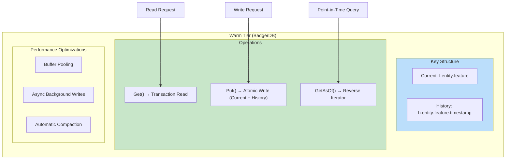

**Key Format Examples:**
```
Current value:   f:user:123:click_count → {"value": 42, "ts": 1705320600}
Historical:      h:user:123:click_count:1705320600000000000 → {"value": 40}
Historical:      h:user:123:click_count:1705320500000000000 → {"value": 38}
```

---

### Serving Layer

The serving layer exposes features through multiple protocols optimized for different use cases.

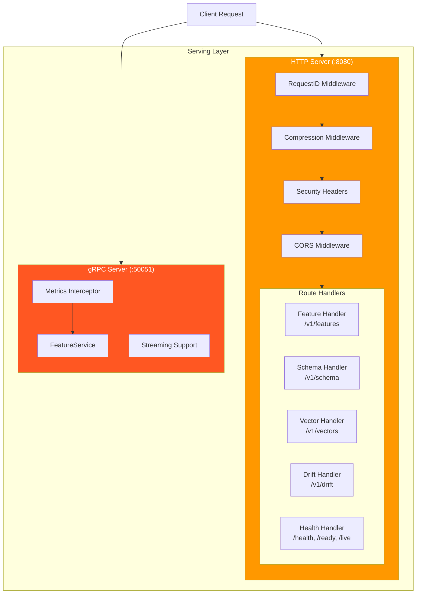

#### HTTP API Endpoints

| Endpoint | Method | Description |
|----------|--------|-------------|
| `/v1/features` | GET | Retrieve features for an entity |
| `/v1/features` | POST | Store features |
| `/v1/features/batch` | POST | Batch retrieval for multiple entities |
| `/v1/features/history` | GET | Point-in-time feature retrieval |
| `/v1/schema/groups` | GET/POST | Manage feature group schemas |
| `/v1/vectors/{index}/search` | POST | Vector similarity search |
| `/v1/drift/status` | GET | Data drift monitoring status |
| `/health` | GET | Deep component health check |
| `/ready` | GET | Kubernetes readiness probe |
| `/live` | GET | Kubernetes liveness probe |

#### gRPC Service Definition

```protobuf
service FeatureService {
  rpc GetFeatures(GetFeaturesRequest) returns (GetFeaturesResponse);
  rpc GetFeaturesAsOf(GetFeaturesAsOfRequest) returns (GetFeaturesResponse);
  rpc PutFeatures(PutFeaturesRequest) returns (PutFeaturesResponse);
  rpc StreamFeatures(stream FeatureUpdate) returns (stream FeatureResponse);
}
```

---

### Ingestion Layer

The ingestion layer supports multiple data sources with built-in resilience patterns.

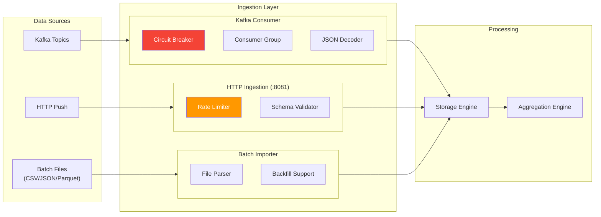

#### Circuit Breaker Pattern

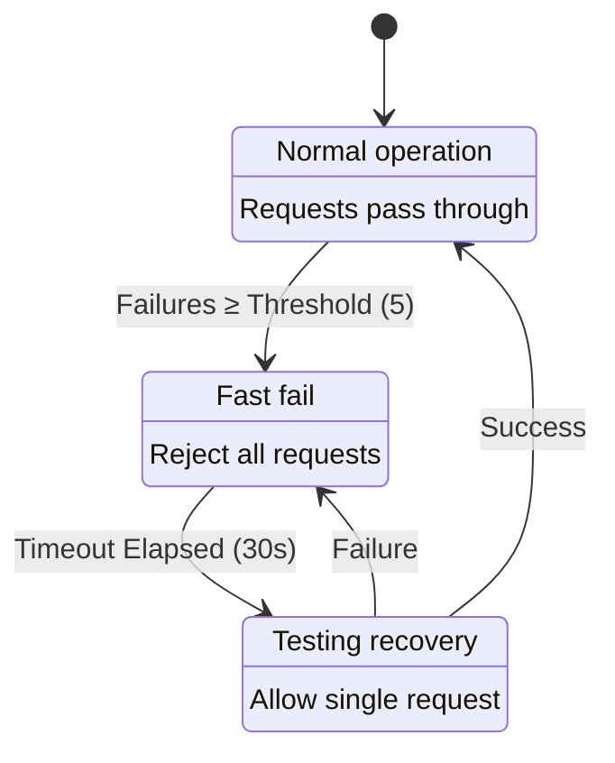

---

### Aggregation Engine

The aggregation engine computes real-time sliding window aggregations incrementally.

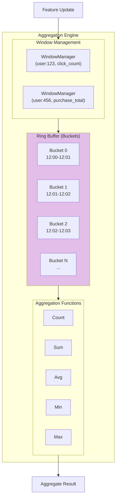

#### Bucket Time Granularity

| Window Size | Bucket Size | Max Buckets |
|-------------|-------------|-------------|
| ≤ 1 hour | 1 minute | 60 |
| ≤ 24 hours | 1 hour | 24 |
| > 24 hours | 1 day | 365 |

#### Bucket Data Structure

```go
type AggregationBucket struct {
    StartTime int64   // Unix nanoseconds (bucket boundary)
    Count     int64   // Number of values in bucket
    Sum       float64 // Sum of values
    Min       float64 // Minimum value
    Max       float64 // Maximum value
    LastValue float64 // Most recent value
}
```

---

## Data Flow

### Write Path (Feature Ingestion)

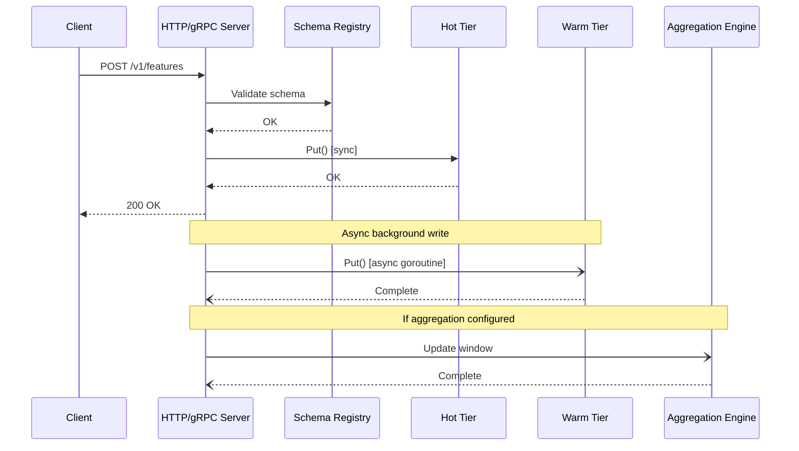

**Write Path Latency Breakdown:**

| Step | Latency | Mode |
|------|---------|------|
| Schema validation | ~0.01ms | Sync |
| Hot tier write | ~0.1ms | Sync |
| Response to client | ~0.15ms total | — |
| Warm tier write | ~2-5ms | Async (background) |
| Aggregation update | ~0.5ms | Async (background) |

### Read Path (Feature Serving)

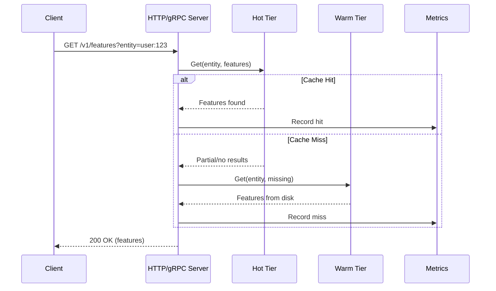

**Read Path Latency Breakdown:**

| Scenario | P50 | P99 | P999 |
|----------|-----|-----|------|
| Hot tier hit | 0.05ms | 0.1ms | 0.2ms |
| Warm tier lookup | 0.5ms | 2ms | 5ms |
| Mixed (with miss) | 0.3ms | 1ms | 3ms |

### Point-in-Time Query Flow

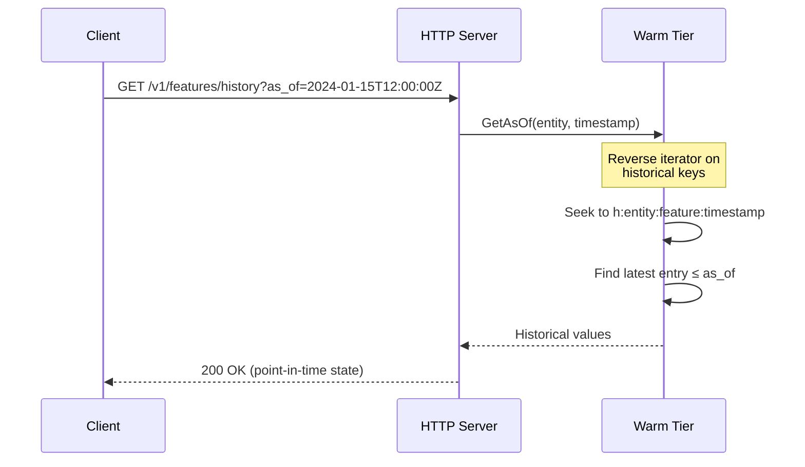

---

## Concurrency Model

### Lock Hierarchy

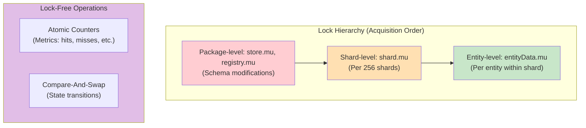

### Read-Write Patterns

```go
// Read path (multiple goroutines can race safely)
shard.mu.RLock()
entity, ok := shard.data[entityKey]
shard.mu.RUnlock()
if ok {
    entity.mu.RLock()
    result := entity.features[featureName]
    entity.mu.RUnlock()
}

// Write path (serialized per entity)
shard.mu.Lock()
entity := shard.data[entityKey]
shard.mu.Unlock()
entity.mu.Lock()
entity.features[name] = value
entity.mu.Unlock()
```

---

## Observability

### Metrics Architecture

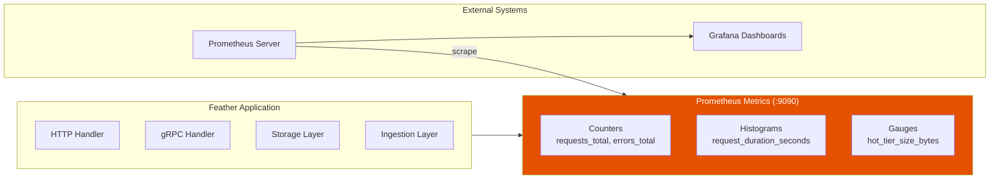

### Key Metrics

| Metric | Type | Description |
|--------|------|-------------|
| `feather_http_requests_total` | Counter | Total HTTP requests by method, path, status |
| `feather_http_request_duration_seconds` | Histogram | Request latency distribution |
| `feather_cache_hits_total` | Counter | Hot tier cache hits |
| `feather_cache_misses_total` | Counter | Hot tier cache misses |
| `feather_hot_tier_size_bytes` | Gauge | Current hot tier memory usage |
| `feather_features_stored_total` | Counter | Total features written |
| `feather_ingestion_messages_total` | Counter | Kafka messages processed |

### Tracing Integration

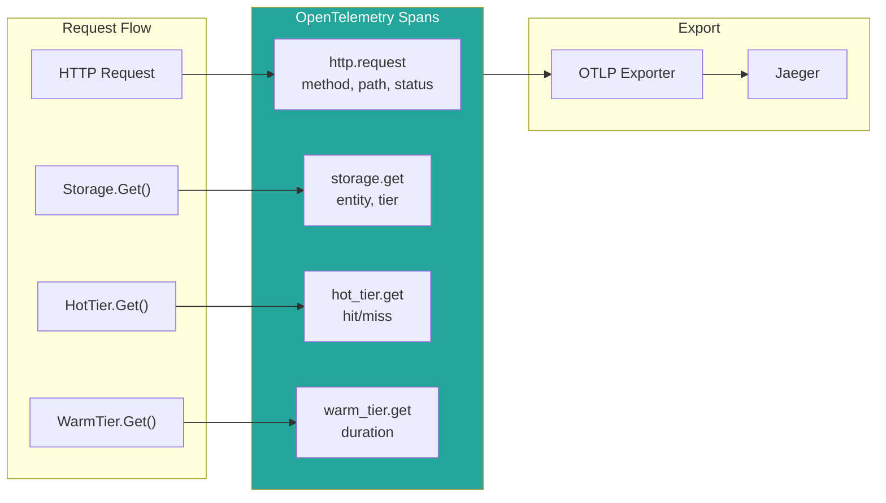

---

## Extension Points

### Vector Similarity Search

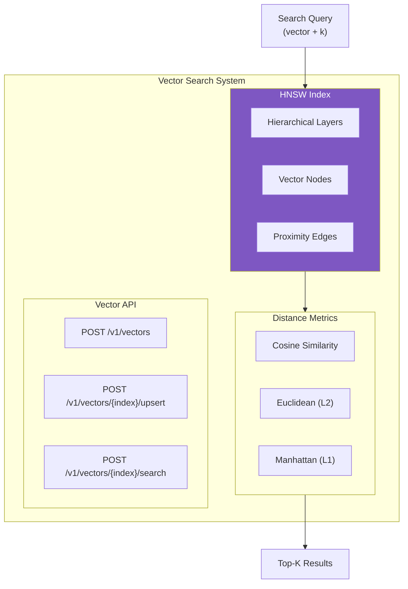

### Data Drift Detection

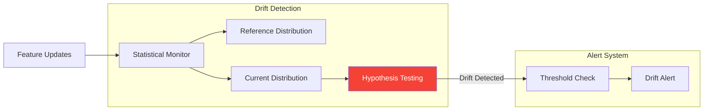

---

## Performance Characteristics

### Latency Profile

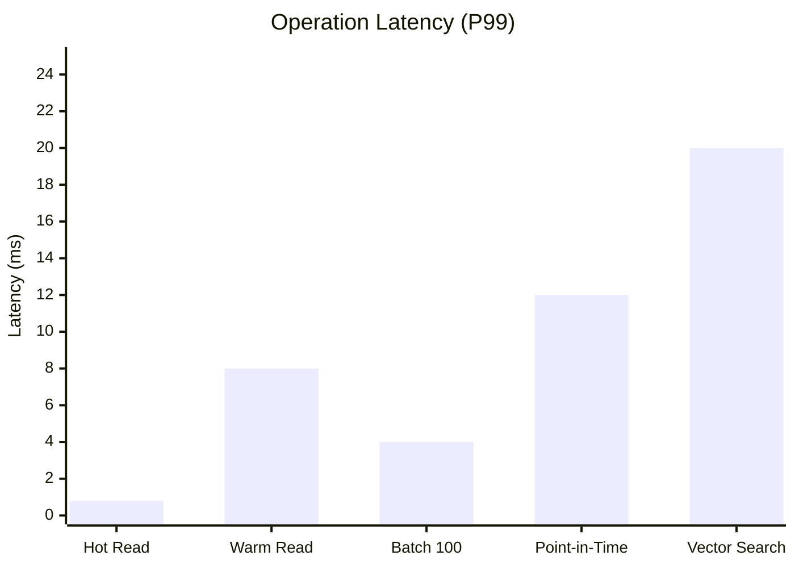

### Throughput Capacity

| Operation | Single Node | 3-Node Cluster |
|-----------|-------------|----------------|
| Reads (hot) | 1M ops/sec | 3M ops/sec |
| Reads (warm) | 100K ops/sec | 300K ops/sec |
| Writes | 50K ops/sec | 150K ops/sec |
| Batch reads | 10K batches/sec | 30K batches/sec |

### Memory Efficiency

- **Per feature overhead**: ~100 bytes + value size
- **Entity index overhead**: ~50 bytes per entity
- **Shard overhead**: ~1KB per shard (256 total)
- **Recommended ratio**: 1B features in 64GB memory

---

## Deployment Patterns

### Single Node Deployment

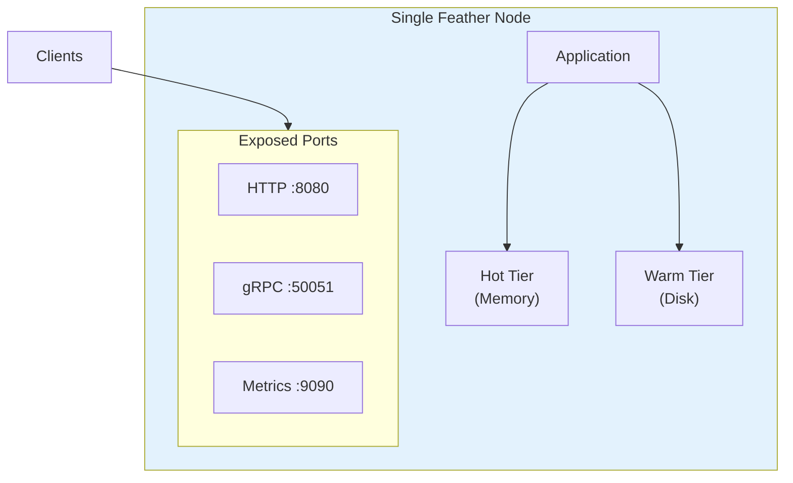

### Kubernetes Deployment

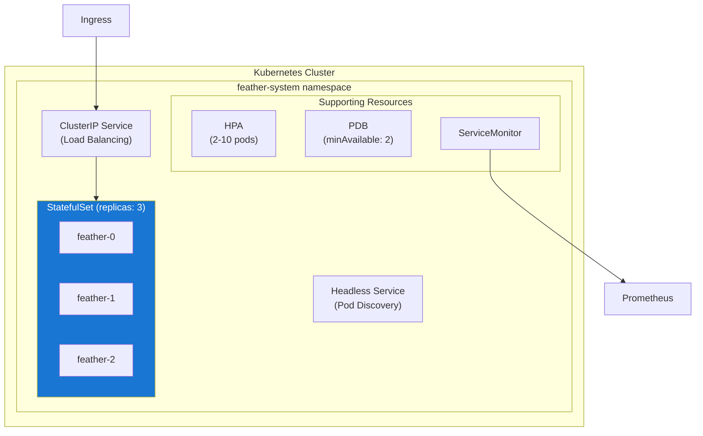

### Federated Multi-Region

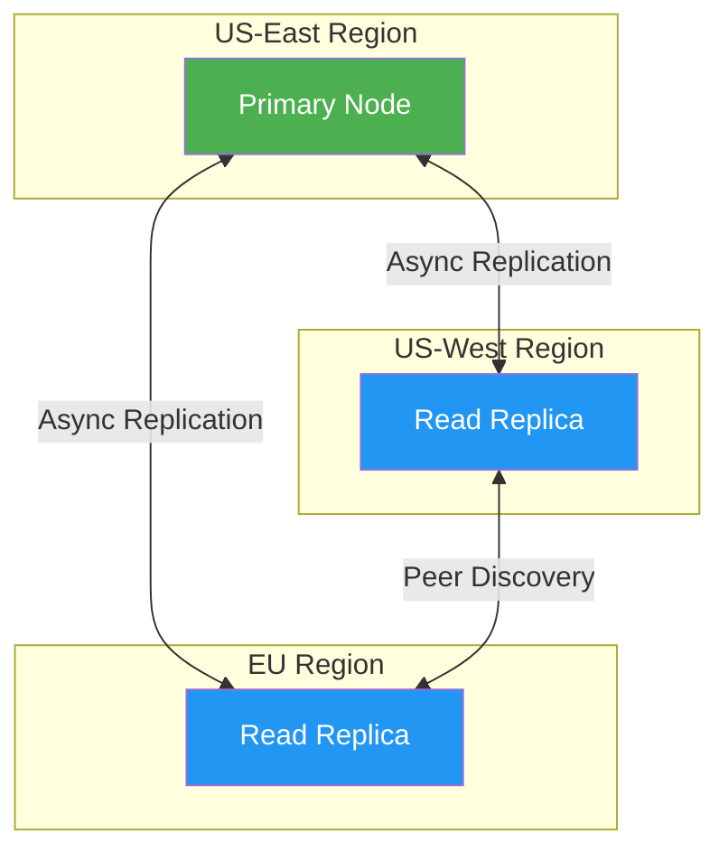

---

## Key Interfaces

### Core Abstractions

```go
// SchemaRegistry validates and manages feature schemas
type SchemaRegistry interface {
    GetGroup(name string) (*domain.FeatureGroup, error)
    GetFeatureSpec(featureName string) (*domain.FeatureSpec, error)
    ListGroups() []*domain.FeatureGroup
}

// StorageTier represents a storage tier (hot or warm)
type StorageTier interface {
    Get(entityKey string, features []string) (map[string]*domain.FeatureValue, error)
    Put(entityKey string, features map[string]*domain.FeatureValue) error
    Delete(entityKey string) error
}

// HealthChecker provides component health status
type HealthChecker interface {
    Check() *HealthCheckResult
    IsReady() bool
    IsHealthy() bool
}
```

---

## Further Reading

- [API Reference](./api-reference.md) - Detailed API documentation
- [Deployment Guide](./deployment.md) - Production deployment instructions
- [Contributing Guide](./contributing.md) - Development guidelines
- [Performance Tuning](./performance.md) - Optimization strategies
