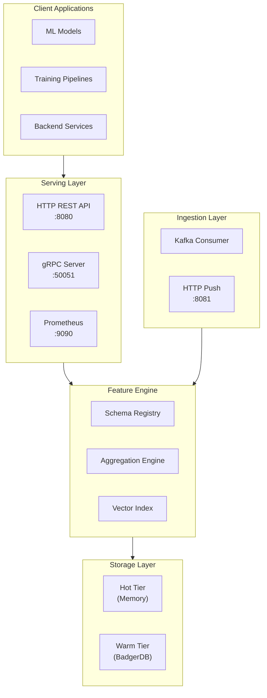
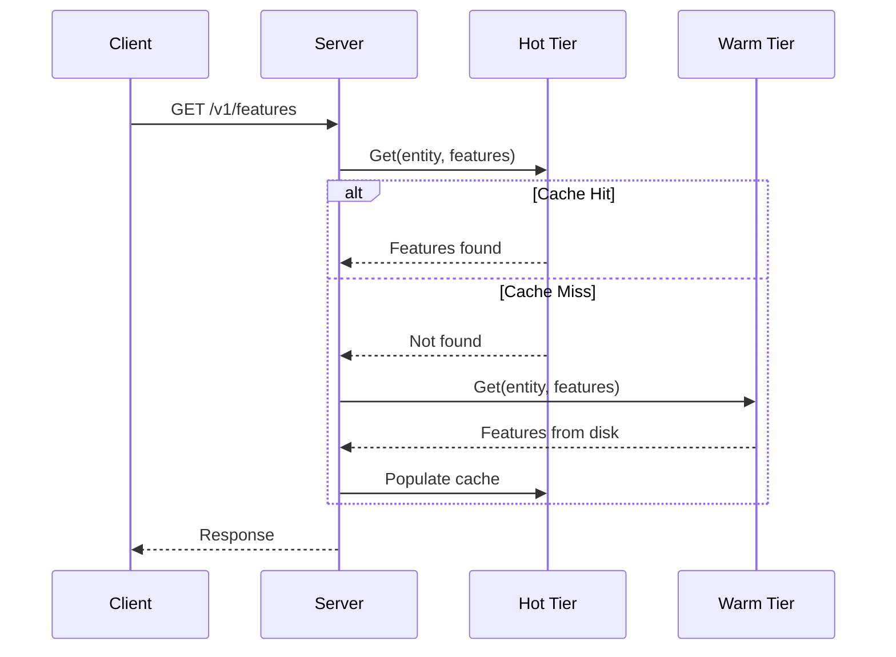
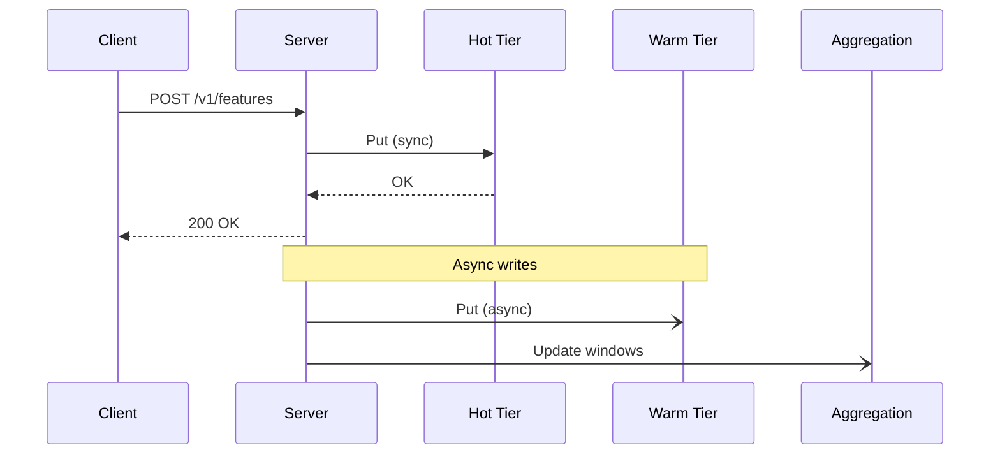

# Architecture Overview

Feather is designed around a core principle: **optimize for the common case while supporting the full range of access patterns**. This page explains how the system is structured and why.

## Design Principles

| Principle | Implementation |
|-----------|----------------|
| **Low Latency** | Two-tier storage with in-memory hot cache |
| **High Throughput** | 256-shard design with fine-grained locking |
| **Durability** | BadgerDB-backed warm tier with versioning |
| **Observability** | Prometheus metrics, OpenTelemetry tracing |
| **Resilience** | Circuit breakers, graceful degradation |
| **Simplicity** | Single binary, embedded storage |

## High-Level Architecture



## Component Overview

### Serving Layer

The serving layer handles all client requests through two protocols:

**HTTP REST API (port 8080)**
- Feature retrieval and storage
- Batch operations
- Point-in-time queries
- Health checks and probes

**gRPC Server (port 50051)**
- Binary protocol for low latency
- Streaming support for large datasets
- Used by high-performance clients

### Feature Engine

The feature engine processes requests and manages data:

**Schema Registry**
- Stores feature group definitions
- Validates data types on write
- Manages feature metadata

**Aggregation Engine**
- Computes sliding window aggregations
- Incrementally updates on each write
- Supports count, sum, avg, min, max

**Vector Index**
- HNSW algorithm for similarity search
- Multiple distance metrics
- Per-index configuration

### Storage Layer

The storage layer uses a two-tier architecture:

**Hot Tier (Memory)**
- 256-shard LRU cache
- Sub-millisecond access
- Automatic eviction under memory pressure

**Warm Tier (BadgerDB)**
- Persistent storage
- Historical versions
- Point-in-time queries

### Ingestion Layer

Data enters Feather through two paths:

**Kafka Consumer**
- Stream processing from Kafka topics
- Circuit breaker for resilience
- At-least-once delivery

**HTTP Push (port 8081)**
- Direct writes from applications
- Rate limiting per client
- Bulk ingestion support

## Data Flow

### Read Path



**Latency breakdown:**
- Hot tier hit: < 1ms P99
- Warm tier lookup: 1-10ms P99
- Cache population: async, doesn't block response

### Write Path



**Key characteristics:**
- Hot tier write is synchronous (immediate visibility)
- Warm tier write is asynchronous (durability)
- Client response doesn't wait for warm tier

## Concurrency Model

Feather uses a hierarchical locking strategy to maximize throughput:

```
Package Level
└── Shard Level (256 shards)
    └── Entity Level (per entity within shard)
```

**Lock types:**
- **RWMutex**: Allows concurrent reads, exclusive writes
- **Atomic counters**: Lock-free metrics updates

**Sharding:**
- FNV-1a hash distributes entities across shards
- 256 shards allows ~256 concurrent operations
- Shard selection: `hash(entityKey) % 256`

## Memory Management

### Hot Tier Memory

The hot tier tracks memory usage approximately:

```
Per feature overhead: ~100 bytes
Per entity overhead:  ~50 bytes
Shard overhead:       ~1KB each (256 total)
```

**Eviction:**
- Triggered when `hot_tier_size > max_memory`
- LRU eviction removes oldest accessed entries
- Background goroutine runs every minute

### Object Pooling

High-throughput paths use `sync.Pool` to reduce allocations:

- Slice pools for feature names and entity keys
- Buffer pools for JSON encoding
- Reduced GC pressure under load

## Observability

### Metrics (Prometheus)

```
feather_http_requests_total{method, path, status}
feather_http_request_duration_seconds{method, path}
feather_cache_hits_total
feather_cache_misses_total
feather_hot_tier_size_bytes
feather_features_stored_total
```

### Tracing (OpenTelemetry)

Spans are created for:
- HTTP/gRPC requests
- Storage operations (hot/warm)
- Aggregation computations
- External calls (Kafka)

### Logging (slog)

Structured logging with levels:
- `debug`: Detailed operation traces
- `info`: Normal operations
- `warn`: Recoverable issues
- `error`: Failures requiring attention

## Extension Points

Feather is designed for extensibility:

| Extension | Interface | Purpose |
|-----------|-----------|---------|
| Custom aggregations | `AggFunction` | Add new aggregation types |
| Data types | `domain.DataType` | Support new value types |
| Ingestion sources | `Ingester` | Add Pulsar, Kinesis, etc. |
| Export formats | `Exporter` | Add Avro, ORC, etc. |

## Deployment Considerations

### Single Node

Suitable for:
- < 10M entities
- < 50K QPS
- < 32GB hot tier

### Scaling Patterns

When single node isn't enough:
1. **Vertical scaling**: Larger machine, more memory
2. **Read replicas**: Multiple nodes serving reads
3. **Sharded cluster**: Consistent hashing across nodes (roadmap)

## Related Documentation

- [Tiered Storage](./tiered-storage) - Deep dive into hot and warm tiers
- [Feature Groups](./feature-groups) - Schema design patterns
- [ADR-0001: Tiered Storage Architecture](/docs/adr/tiered-storage) - Design decision rationale
