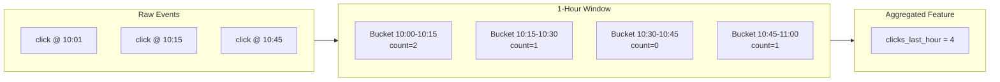

# Feature Groups & Schema

Feature groups are logical collections of related features that share an entity type. They provide schema validation, organization, and configuration for your features.

## What is a Feature Group?

A feature group defines:
- **Entity type**: What the features describe (user, product, transaction)
- **Features**: The individual feature definitions with types
- **TTL**: How long features remain valid
- **Aggregations**: Optional sliding window computations

```yaml
schema:
  groups:
    - name: user_engagement
      entity_type: user
      ttl: 24h
      features:
        - name: click_count
          data_type: int64
        - name: purchase_total
          data_type: float64
        - name: last_activity
          data_type: timestamp
```

## Defining Feature Groups

### Via Configuration File

```yaml title="feather.yaml"
schema:
  groups:
    # User engagement features
    - name: user_engagement
      entity_type: user
      ttl: 24h
      description: "User interaction metrics"
      features:
        - name: click_count
          data_type: int64
          description: "Total clicks in session"
        - name: purchase_total
          data_type: float64
          description: "Lifetime purchase amount"
        - name: is_premium
          data_type: bool
          description: "Premium subscription status"
        - name: last_activity
          data_type: timestamp
          description: "Last interaction time"

    # Product features
    - name: product_catalog
      entity_type: product
      ttl: 1h
      features:
        - name: price
          data_type: float64
        - name: category
          data_type: string
        - name: embedding
          data_type: vector
          dimensions: [384]
        - name: in_stock
          data_type: bool
```

### Via HTTP API

```bash
curl -X POST http://localhost:8080/v1/schema/groups \
  -H "Content-Type: application/json" \
  -d '{
    "name": "user_engagement",
    "entity_type": "user",
    "ttl": "24h",
    "features": [
      {"name": "click_count", "data_type": "int64"},
      {"name": "purchase_total", "data_type": "float64"},
      {"name": "is_premium", "data_type": "bool"}
    ]
  }'
```

## Supported Data Types

| Type | Go Type | JSON Example | Use Case |
|------|---------|--------------|----------|
| `int64` | `int64` | `42` | Counts, IDs |
| `float64` | `float64` | `3.14` | Prices, scores |
| `string` | `string` | `"premium"` | Categories, text |
| `bool` | `bool` | `true` | Flags, status |
| `bytes` | `[]byte` | `"base64..."` | Binary data |
| `timestamp` | `time.Time` | `"2024-01-15T..."` | Dates, times |
| `vector` | `[]float32` | `[0.1, 0.2, ...]` | Embeddings |

### Vector Type

Vectors require dimension specification:

```yaml
features:
  - name: user_embedding
    data_type: vector
    dimensions: [384]  # Must match your embedding model
```

### Timestamp Type

Timestamps are stored as Unix nanoseconds internally but accept RFC3339 in JSON:

```json
{
  "entity_key": "user:123",
  "features": {
    "last_login": "2024-01-15T10:30:00Z"
  }
}
```

## Entity Keys

Entity keys identify the subject of features. Use a consistent format:

```
{entity_type}:{identifier}
```

**Examples:**
```
user:12345
product:sku-abc-123
transaction:tx-2024-01-15-001
session:sess_a1b2c3d4
```

**Best practices:**
- Include entity type prefix for clarity
- Use stable identifiers (not timestamps)
- Keep keys reasonably short (< 256 bytes)

## Feature Naming

### Conventions

```yaml
# Good: descriptive, snake_case
features:
  - name: click_count_last_7d
  - name: avg_order_value
  - name: is_premium_user

# Avoid: ambiguous, inconsistent
features:
  - name: cnt        # Too short
  - name: ClickCount # CamelCase
  - name: feature_1  # Not descriptive
```

### Namespacing

For large deployments, consider namespaced feature names:

```yaml
features:
  - name: engagement_click_count
  - name: engagement_session_duration
  - name: purchase_total_amount
  - name: purchase_last_date
```

## Aggregations

Feature groups can define sliding window aggregations:

```yaml
schema:
  groups:
    - name: user_engagement
      entity_type: user
      features:
        - name: clicks_last_hour
          data_type: int64
          aggregation:
            function: count
            source_feature: click_event
            window: 1h
            slide_by: 1m

        - name: spend_last_24h
          data_type: float64
          aggregation:
            function: sum
            source_feature: purchase_amount
            window: 24h
            slide_by: 1h

        - name: avg_session_duration
          data_type: float64
          aggregation:
            function: avg
            source_feature: session_duration
            window: 7d
            slide_by: 1d
```

### Aggregation Functions

| Function | Description | Output Type |
|----------|-------------|-------------|
| `count` | Number of values in window | int64 |
| `sum` | Sum of values | float64 |
| `avg` | Mean of values | float64 |
| `min` | Minimum value | float64 |
| `max` | Maximum value | float64 |
| `last` | Most recent value | same as source |

### How Aggregations Work



Aggregations are computed incrementally:
- Each event updates its bucket
- Queries sum across relevant buckets
- Old buckets are discarded as window slides

## Schema Validation

When schema validation is enabled, Feather enforces:

1. **Type checking**: Values must match declared type
2. **Required features**: All features in group must be present
3. **Vector dimensions**: Must match declared dimensions

### Enabling Validation

```yaml
schema:
  validation:
    enabled: true
    strict: false  # Allow unknown features
```

### Validation Modes

| Mode | Unknown Features | Type Mismatch |
|------|------------------|---------------|
| `strict: true` | Rejected | Rejected |
| `strict: false` | Allowed | Rejected |
| `validation: false` | Allowed | Allowed |

## Listing Feature Groups

### Via HTTP API

```bash
# List all groups
curl http://localhost:8080/v1/schema/groups

# Get specific group
curl http://localhost:8080/v1/schema/groups/user_engagement
```

### Response

```json
{
  "groups": [
    {
      "name": "user_engagement",
      "entity_type": "user",
      "ttl": "24h",
      "features": [
        {"name": "click_count", "data_type": "int64"},
        {"name": "purchase_total", "data_type": "float64"}
      ]
    }
  ]
}
```

## Best Practices

### 1. Group by Entity Type

```yaml
# Good: one group per entity type + domain
groups:
  - name: user_engagement
    entity_type: user
  - name: user_demographics
    entity_type: user
  - name: product_catalog
    entity_type: product
```

### 2. Set Appropriate TTLs

```yaml
# Real-time features: short TTL
- name: session_features
  ttl: 1h

# Daily features: longer TTL
- name: daily_aggregates
  ttl: 24h

# Slowly changing: very long TTL
- name: user_demographics
  ttl: 30d
```

### 3. Document Your Features

```yaml
features:
  - name: click_count_7d
    data_type: int64
    description: "Number of clicks in the last 7 days"
    tags:
      owner: ml-team
      model: churn-prediction
```

### 4. Version Your Schemas

When making breaking changes, create new feature groups:

```yaml
# Old (keep for backward compatibility)
- name: user_features_v1

# New (with updated schema)
- name: user_features_v2
```

## Related Documentation

- [Point-in-Time Queries](./point-in-time) - Historical feature retrieval
- [API Reference](/docs/api-reference) - Schema API details
- [Configuration](/docs/configuration) - Full schema options
