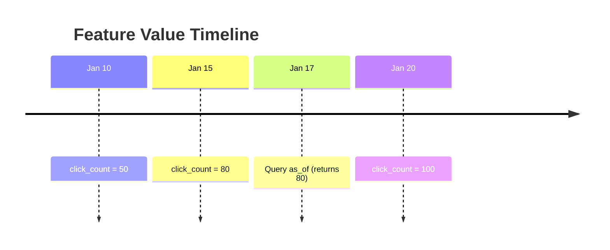
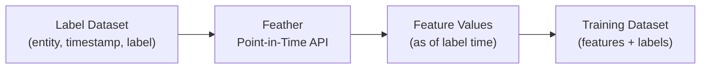

# Point-in-Time Queries

Point-in-time queries let you retrieve feature values as they existed at a specific moment in history. This capability is essential for generating training data without data leakage.

## Why Point-in-Time Matters

### The Data Leakage Problem

When training ML models, you need features that were available **at prediction time**, not features from the future.

**Example: Churn Prediction**

You want to predict if a user will churn in the next 30 days. Your training data includes:
- Label: Did the user churn? (recorded on Feb 15)
- Features: User activity metrics

**Wrong approach:**
```
Label time:    Feb 15 (user churned)
Feature time:  Feb 20 (current values)  ← FUTURE DATA!
```

Using Feb 20 features to predict Feb 15 churn is cheating—the model sees the future.

**Correct approach:**
```
Label time:    Feb 15 (user churned)
Feature time:  Feb 15 (as_of query)     ← CORRECT!
```

Point-in-time queries ensure you only use features that existed at the label timestamp.

## How It Works

Feather stores feature history using versioned keys:

```
h:user:123:click_count:9223370337854775807  → 100 (Jan 20)
h:user:123:click_count:9223370337914775807  → 80  (Jan 15)
h:user:123:click_count:9223370337974775807  → 50  (Jan 10)
```

When you query `as_of=Jan 17`, Feather finds the latest value that existed before that time (80 from Jan 15).



## Making Point-in-Time Queries

### HTTP API

```bash
curl "http://localhost:8080/v1/features/history?entity=user:123&feature=click_count&as_of=2024-01-17T00:00:00Z"
```

**Response:**
```json
{
  "success": true,
  "data": {
    "entities": {
      "user:123": {
        "features": {
          "click_count": {
            "value": 80,
            "timestamp": 1705276800000000000
          }
        }
      }
    }
  },
  "as_of": "2024-01-17T00:00:00Z"
}
```

### Batch Point-in-Time

Query multiple entities at different timestamps:

```bash
curl -X POST http://localhost:8080/v1/features/history/batch \
  -H "Content-Type: application/json" \
  -d '{
    "queries": [
      {
        "entity": "user:123",
        "features": ["click_count", "purchase_total"],
        "as_of": "2024-01-15T00:00:00Z"
      },
      {
        "entity": "user:456",
        "features": ["click_count", "purchase_total"],
        "as_of": "2024-01-16T00:00:00Z"
      }
    ]
  }'
```

### Python SDK

```python
from feather import FeatherClient
import pandas as pd

client = FeatherClient("localhost:8080")

# Single point-in-time query
features = client.get_features_as_of(
    entity="user:123",
    features=["click_count", "purchase_total"],
    as_of="2024-01-15T00:00:00Z"
)

# Batch query for training data
training_examples = [
    {"entity": "user:123", "label_time": "2024-01-15T00:00:00Z", "label": 1},
    {"entity": "user:456", "label_time": "2024-01-16T00:00:00Z", "label": 0},
    {"entity": "user:789", "label_time": "2024-01-17T00:00:00Z", "label": 1},
]

training_data = []
for example in training_examples:
    features = client.get_features_as_of(
        entity=example["entity"],
        features=["click_count", "purchase_total", "days_since_signup"],
        as_of=example["label_time"]
    )
    training_data.append({
        "entity": example["entity"],
        "label": example["label"],
        **features
    })

df = pd.DataFrame(training_data)
```

### Go SDK

```go
import (
    "time"
    "github.com/feather-store/feather/sdk/go/feather"
)

client, _ := feather.NewClient("localhost:8080")

// Point-in-time query
asOf := time.Date(2024, 1, 15, 0, 0, 0, 0, time.UTC)
features, err := client.GetFeaturesAsOf(ctx, "user:123",
    []string{"click_count", "purchase_total"}, asOf)

// Batch processing
type TrainingExample struct {
    Entity    string
    LabelTime time.Time
    Label     int
}

examples := []TrainingExample{
    {"user:123", time.Date(2024, 1, 15, 0, 0, 0, 0, time.UTC), 1},
    {"user:456", time.Date(2024, 1, 16, 0, 0, 0, 0, time.UTC), 0},
}

for _, ex := range examples {
    features, _ := client.GetFeaturesAsOf(ctx, ex.Entity,
        []string{"click_count", "purchase_total"}, ex.LabelTime)
    // Use features for training
}
```

## Generating Training Data

### The Training Data Pipeline



### Example: Building a Training Dataset

```python
from feather import FeatherClient
import pandas as pd

# Your labels with timestamps
labels_df = pd.DataFrame({
    "user_id": ["user:123", "user:456", "user:789"],
    "label_time": ["2024-01-15", "2024-01-16", "2024-01-17"],
    "churned": [1, 0, 1]
})

client = FeatherClient("localhost:8080")
feature_names = ["click_count", "purchase_total", "days_since_signup"]

# Fetch point-in-time features for each label
features_list = []
for _, row in labels_df.iterrows():
    features = client.get_features_as_of(
        entity=row["user_id"],
        features=feature_names,
        as_of=row["label_time"]
    )
    features_list.append(features)

# Combine labels and features
features_df = pd.DataFrame(features_list)
training_df = pd.concat([labels_df, features_df], axis=1)

# Ready for model training!
print(training_df)
```

## History Retention

### Configuration

Control how long historical versions are kept:

```yaml
storage:
  warm:
    history:
      max_versions: 100      # Keep last 100 versions per feature
      max_age: 30d           # Or versions younger than 30 days
      gc_interval: 1h        # Clean up check frequency
```

### Trade-offs

| Setting | Storage Cost | Query Range |
|---------|--------------|-------------|
| `max_versions: 10` | Low | Recent history only |
| `max_versions: 100` | Medium | ~3 months typical |
| `max_age: 30d` | Medium | Fixed 30-day window |
| `max_age: 365d` | High | Full year of history |

### Checking Available History

```bash
# Get the oldest available version for a feature
curl "http://localhost:8080/v1/features/history/range?entity=user:123&feature=click_count"
```

Response:
```json
{
  "entity": "user:123",
  "feature": "click_count",
  "oldest_version": "2023-12-01T00:00:00Z",
  "newest_version": "2024-01-20T15:30:00Z",
  "version_count": 45
}
```

## Performance Considerations

### Query Latency

Point-in-time queries are warm tier only (historical data isn't in hot tier):

| Operation | Latency |
|-----------|---------|
| Single feature, single entity | 1-5ms |
| Multiple features, single entity | 2-10ms |
| Batch (100 entities) | 50-200ms |

### Optimizing Large Batch Queries

For training data generation with millions of rows:

1. **Batch your requests**: Use batch API instead of individual calls
2. **Parallelize**: Make concurrent requests for different entity batches
3. **Export to files**: Use the export API for very large datasets

```python
# Parallel batch processing
import concurrent.futures

def fetch_batch(entities_batch):
    return client.get_features_as_of_batch(entities_batch)

with concurrent.futures.ThreadPoolExecutor(max_workers=10) as executor:
    batches = [entities[i:i+100] for i in range(0, len(entities), 100)]
    results = list(executor.map(fetch_batch, batches))
```

### Using the Export API

For very large datasets, export directly to files:

```bash
curl -X POST http://localhost:8080/v1/export \
  -H "Content-Type: application/json" \
  -d '{
    "format": "parquet",
    "queries": [...],
    "output_path": "s3://bucket/training-data/"
  }'
```

## Best Practices

### 1. Always Use Label Timestamps

```python
# Good: Feature time matches label time
features = client.get_features_as_of(entity, features, label_time)

# Bad: Using current time
features = client.get_features(entity, features)  # Data leakage!
```

### 2. Validate Time Ranges

```python
# Check if history covers your training period
for entity, label_time in training_data:
    range_info = client.get_history_range(entity, feature)
    if label_time < range_info["oldest_version"]:
        print(f"Warning: No history for {entity} at {label_time}")
```

### 3. Handle Missing History

```python
try:
    features = client.get_features_as_of(entity, features, as_of)
except HistoryNotFoundError:
    # Use defaults or skip this training example
    features = {"click_count": 0, "purchase_total": 0.0}
```

### 4. Document Your Feature Timestamps

Track what timestamp represents for each feature:
- **Event time**: When the event occurred
- **Processing time**: When the feature was computed
- **Observation time**: When the feature was recorded

## Related Documentation

- [Tiered Storage](./tiered-storage) - How history is stored
- [ADR-0014: Versioned Keys](/docs/adr/point-in-time-versioned-keys) - Implementation details
- [Offline Sync](/docs/guides/offline-sync) - Export for batch training
