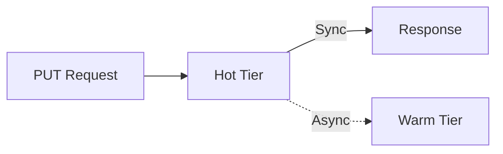

# Tiered Storage

Feather uses a two-tier storage architecture to optimize for both latency and durability. This page explains how each tier works and how they interact.

## The Two Tiers

| Tier | Backing Store | Latency | Durability | Use Case |
|------|---------------|---------|------------|----------|
| **Hot** | In-memory LRU | < 1ms P99 | Volatile | Real-time serving |
| **Warm** | BadgerDB | 1-10ms P99 | Persistent | Historical queries |

## Hot Tier

The hot tier is an in-memory cache optimized for maximum throughput with minimal latency.

### Architecture

```
┌──────────────────────────────────────────────────────────────┐
│                         Hot Tier                              │
├──────────────────────────────────────────────────────────────┤
│  ┌─────────┐ ┌─────────┐ ┌─────────┐       ┌─────────┐      │
│  │ Shard 0 │ │ Shard 1 │ │ Shard 2 │  ...  │Shard 255│      │
│  │ RWMutex │ │ RWMutex │ │ RWMutex │       │ RWMutex │      │
│  │ HashMap │ │ HashMap │ │ HashMap │       │ HashMap │      │
│  │ LRU List│ │ LRU List│ │ LRU List│       │ LRU List│      │
│  └─────────┘ └─────────┘ └─────────┘       └─────────┘      │
└──────────────────────────────────────────────────────────────┘
```

### Sharding Strategy

- **256 shards**: Power of 2 for fast modulo operation
- **FNV-1a hashing**: Fast, well-distributed hash function
- **Shard selection**: `shard = fnv1a(entityKey) & 0xFF`

This design reduces lock contention by distributing entities across independent shards.

### Per-Shard Structure

Each shard contains:

```go
type shard struct {
    mu       sync.RWMutex           // Shard-level lock
    entities map[string]*entityData // Entity -> features
    lruHead  *entityData            // LRU list head
    lruTail  *entityData            // LRU list tail
}

type entityData struct {
    mu        sync.RWMutex                    // Entity-level lock
    features  map[string]*domain.FeatureValue // Feature values
    lruPrev   *entityData                     // LRU pointer
    lruNext   *entityData                     // LRU pointer
    lastAccess int64                          // For TTL
}
```

### Locking Hierarchy

```
Read Operation:
1. Acquire shard RLock
2. Lookup entity
3. Acquire entity RLock
4. Read features
5. Release entity RLock
6. Release shard RLock

Write Operation:
1. Acquire shard Lock
2. Get or create entity
3. Release shard Lock (downgrade)
4. Acquire entity Lock
5. Write features
6. Release entity Lock
```

### Memory Management

**Approximate size tracking:**
```
Each feature: ~100 bytes overhead + value size
Each entity:  ~50 bytes overhead
Total:        Tracked with atomic counter
```

**Eviction triggers:**
- Memory exceeds `max_memory` configuration
- Background check runs every 60 seconds
- LRU eviction removes least recently accessed

### Configuration

```yaml
storage:
  hot:
    max_memory: "8GB"      # Maximum memory for hot tier
    ttl: "2h"              # Default TTL for entries
    num_shards: 256        # Number of shards (default)
```

Environment variables:
```bash
FEATHER_HOT_MAX_MEMORY=8GB
FEATHER_HOT_TTL=2h
```

## Warm Tier

The warm tier provides persistent storage with historical versioning using BadgerDB.

### Why BadgerDB?

| Criteria | BadgerDB | Alternatives |
|----------|----------|--------------|
| Pure Go | ✅ | RocksDB requires CGo |
| Write performance | LSM-tree optimized | BoltDB is B-tree |
| Compression | ZSTD built-in | Varies |
| Transactions | ACID with MVCC | Varies |
| Maintenance | No external process | Redis/Postgres need ops |

### Key Schema

Features are stored with composite keys:

```
Current value:    c:{entity}:{feature}
Historical value: h:{entity}:{feature}:{inverted_timestamp}
```

**Example:**
```
c:user:123:click_count                      → current value
h:user:123:click_count:9223370337854775807  → value at 2024-01-15
h:user:123:click_count:9223370337914775807  → value at 2024-01-14
```

**Why inverted timestamps?**
- BadgerDB iterates in ascending order
- Inverted timestamps put newest values first
- Point-in-time queries find the right version quickly

### Operations

**Get (current value):**
```go
func (w *WarmTier) Get(entityID, feature string) (*FeatureValue, error) {
    key := fmt.Sprintf("c:%s:%s", entityID, feature)
    // Single key lookup - O(1)
}
```

**Get As Of (historical):**
```go
func (w *WarmTier) GetAsOf(entityID, feature string, asOf time.Time) (*FeatureValue, error) {
    prefix := fmt.Sprintf("h:%s:%s:", entityID, feature)
    targetInverted := math.MaxInt64 - asOf.UnixNano()

    // Iterate until we find first key with inverted_ts >= target
    // This is the value that existed at query time
}
```

**Put (write both keys):**
```go
func (w *WarmTier) Put(entityID, feature string, value *FeatureValue) error {
    return w.db.Update(func(txn *badger.Txn) error {
        // Write current value
        currentKey := fmt.Sprintf("c:%s:%s", entityID, feature)
        txn.Set([]byte(currentKey), encode(value))

        // Write historical version
        invertedTS := math.MaxInt64 - value.Timestamp
        histKey := fmt.Sprintf("h:%s:%s:%019d", entityID, feature, invertedTS)
        txn.Set([]byte(histKey), encode(value))

        return nil
    })
}
```

### Configuration

```yaml
storage:
  warm:
    path: "/var/lib/feather/data"   # Data directory
    sync_writes: false               # Async for performance
    compression: true                # Enable ZSTD
    block_cache_size: "256MB"        # Read cache
    index_cache_size: "128MB"        # Index cache
```

### Maintenance

**Compaction:**
BadgerDB runs automatic compaction, but you can trigger it:

```bash
# Via API
curl -X POST http://localhost:8080/admin/compact
```

**Backup:**
```bash
# Stop Feather, then copy data directory
cp -r /var/lib/feather/data /backup/feather-$(date +%Y%m%d)
```

## Tier Interaction

### Read Path (Cache-Through)


1. Check hot tier first
2. On hit: return immediately (< 1ms)
3. On miss: fetch from warm tier
4. Populate hot tier with result
5. Return to client

### Write Path (Write-Through)



1. Write to hot tier (synchronous)
2. Return success to client
3. Write to warm tier (asynchronous background)

**Implications:**
- Immediate visibility in hot tier
- Brief window where hot and warm differ
- Acceptable for feature store use case

### TTL Handling

Hot tier entries have TTL:
- Default: 1 hour (configurable)
- Entries evicted after TTL expires
- Background goroutine checks every minute

Warm tier entries persist until:
- Explicit deletion
- Compaction removes expired versions
- Version retention policy applies

## Performance Characteristics

### Latency by Operation

| Operation | Hot Tier | Warm Tier |
|-----------|----------|-----------|
| Single read | 50μs P50, 100μs P99 | 500μs P50, 2ms P99 |
| Batch read (100) | 500μs P50, 1ms P99 | 5ms P50, 15ms P99 |
| Single write | 100μs P50, 300μs P99 | 1ms P50, 5ms P99 |
| Point-in-time | N/A | 1ms P50, 5ms P99 |

### Throughput

On a single node (16 vCPU, 32GB RAM):

| Operation | Throughput |
|-----------|------------|
| Hot tier reads | 1M+ ops/sec |
| Warm tier reads | 100K+ ops/sec |
| Writes (hot+warm) | 50K+ ops/sec |

## Best Practices

### Sizing the Hot Tier

```
Hot tier memory = (avg features per entity) × (avg feature size) × (hot entities)
```

**Example:**
- 10 features per entity × 100 bytes = 1KB per entity
- 1 million hot entities = 1GB hot tier
- Add 20% overhead = 1.2GB recommended

### Optimizing for Cache Hits

1. **Access patterns**: Hot tier works best with skewed access (some entities accessed frequently)
2. **TTL tuning**: Match TTL to your access patterns
3. **Memory sizing**: Ensure hot tier fits your working set

### Monitoring Health

Key metrics to watch:
```
feather_cache_hit_ratio        # Target: > 90%
feather_hot_tier_size_bytes    # Should stay under max
feather_warm_tier_read_latency # Alert if > 10ms P99
feather_evictions_total        # High rate = undersized hot tier
```

## Related Documentation

- [Architecture Overview](./architecture) - System design
- [Performance Tuning](../guides/performance) - Optimization guide
- [ADR-0001: Tiered Storage](/docs/adr/tiered-storage) - Design decision
