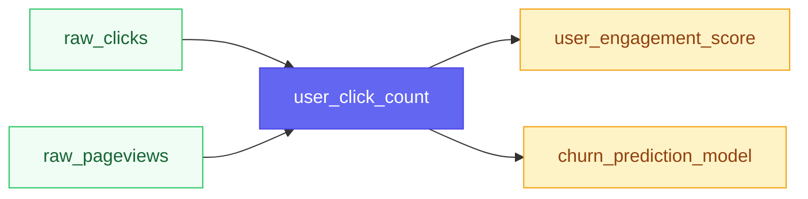

# Feature Catalog UI

Feather includes an embedded web UI for browsing and discovering features in your catalog. The UI requires no separate deployment—it's served directly from the Feather binary.

## Accessing the UI

The catalog UI is available at `/ui/` on your Feather server:

```
http://localhost:8080/ui/
```

The UI is enabled by default. To disable it, set the environment variable:

```bash
FEATHER_UI_ENABLED=false ./feather
```

Or in your config file:

```yaml
ui:
  enabled: false
```

## Features

### Feature Discovery

Browse all registered features in your catalog:

- **Search**: Find features by name, description, or tags
- **Filter by entity type**: Show only features for specific entities (user, product, etc.)
- **Filter by category**: Group features by business domain
- **Filter by status**: View active, experimental, or deprecated features
- **Filter by tags**: Narrow down by custom tags

### Feature Details

Click any feature to view its full details:

- **Data type**: int64, float64, string, vector, etc.
- **Entity type**: The entity this feature describes
- **Owner and team**: Who maintains this feature
- **Tags and metadata**: Custom labels and properties
- **Source information**: Where this feature comes from (dbt, streaming, etc.)
- **Usage example**: Copy-paste code snippets for Go and Python

### Lineage Visualization

View feature dependencies and data flow:

- **Upstream dependencies**: What data sources feed this feature
- **Downstream consumers**: What features or models use this feature
- **Visual graph**: Mermaid-powered diagram of the lineage

Access lineage for a specific feature:

```
http://localhost:8080/ui/#/lineage?feature=user_click_count
```

## Screenshots

### Feature List View

The main view shows all features as cards with key metadata:

```
┌─────────────────────────────────────────────────────────────┐
│  Feather Catalog                          [Search...]  🔍   │
├─────────────────────────────────────────────────────────────┤
│  Filters: [Entity Type ▼] [Category ▼] [Status ▼]          │
├─────────────────────────────────────────────────────────────┤
│  ┌─────────────────────┐  ┌─────────────────────┐          │
│  │ user_click_count    │  │ user_purchase_total │          │
│  │ int64 • user        │  │ float64 • user      │          │
│  │ [ml] [real-time]    │  │ [revenue] [batch]   │          │
│  └─────────────────────┘  └─────────────────────┘          │
│                                                             │
│  ┌─────────────────────┐  ┌─────────────────────┐          │
│  │ product_embedding   │  │ user_segment        │          │
│  │ vector • product    │  │ string • user       │          │
│  │ [ml] [embedding]    │  │ [marketing]         │          │
│  └─────────────────────┘  └─────────────────────┘          │
└─────────────────────────────────────────────────────────────┘
```

### Feature Detail Modal

Clicking a feature opens a detail modal:

```
┌─────────────────────────────────────────────────────────────┐
│  user_click_count                              [active]     │
│  Number of clicks by user in the last 24 hours              │
├─────────────────────────────────────────────────────────────┤
│  Data Type      │ int64                                     │
│  Entity Type    │ user                                      │
│  Owner          │ ml-platform@company.com                   │
│  Team           │ ML Platform                               │
│  Category       │ engagement                                │
│  Version        │ v3                                        │
├─────────────────────────────────────────────────────────────┤
│  Tags: [ml] [real-time] [engagement]                        │
├─────────────────────────────────────────────────────────────┤
│  Usage Example:                                             │
│  ┌───────────────────────────────────────────────────────┐  │
│  │ from feather_client import FeatherClient              │  │
│  │                                                       │  │
│  │ client = FeatherClient("http://localhost:8080")       │  │
│  │ features = client.get_features(                       │  │
│  │     entity_id="user:123",                             │  │
│  │     features=["user_click_count"]                     │  │
│  │ )                                                     │  │
│  └───────────────────────────────────────────────────────┘  │
├─────────────────────────────────────────────────────────────┤
│  [View Lineage]                              [Close]        │
└─────────────────────────────────────────────────────────────┘
```

### Lineage Graph

The lineage view shows upstream and downstream dependencies:



## Keyboard Shortcuts

| Shortcut | Action |
|----------|--------|
| `Cmd/Ctrl + K` | Focus search bar |
| `Escape` | Close modal / Clear search |

## API Integration

The UI uses Feather's catalog API endpoints:

| Endpoint | Purpose |
|----------|---------|
| `GET /v1/catalog/features` | List all features |
| `GET /v1/catalog/features/{name}` | Get feature details |
| `GET /v1/catalog/features/{name}/lineage` | Get feature lineage |

You can use these same endpoints programmatically:

```bash
# List all features
curl http://localhost:8080/v1/catalog/features

# Get feature details
curl http://localhost:8080/v1/catalog/features/user_click_count

# Get lineage
curl http://localhost:8080/v1/catalog/features/user_click_count/lineage
```

## Customization

### Registering Features

Features appear in the catalog when registered via:

1. **Schema configuration** in `feather.yaml`
2. **dbt sync** (see [dbt Integration](./dbt-integration))
3. **Catalog API** directly

Example schema registration:

```yaml
schema:
  groups:
    - name: user_features
      entity_type: user
      features:
        - name: click_count
          data_type: int64
          description: Number of clicks in last 24h
          tags: [ml, real-time]
          owner: ml-platform@company.com
```

### Feature Metadata

Enrich your features with metadata for better discoverability:

```yaml
features:
  - name: user_click_count
    data_type: int64
    description: "Number of clicks by user in the last 24 hours"
    category: engagement
    owner: ml-platform@company.com
    team: ML Platform
    tags:
      - ml
      - real-time
      - engagement
    metadata:
      freshness_sla: 5m
      data_source: clickstream
```

## Troubleshooting

### UI Not Loading

1. **Check if UI is enabled:**
   ```bash
   curl http://localhost:8080/ui/
   ```

2. **Verify server is running:**
   ```bash
   curl http://localhost:8080/health
   ```

3. **Check browser console** for JavaScript errors

### No Features Displayed

1. **Verify features are registered:**
   ```bash
   curl http://localhost:8080/v1/catalog/features
   ```

2. **Check schema configuration** in your config file

3. **If using dbt**, ensure sync completed:
   ```bash
   curl http://localhost:8080/v1/dbt/status
   ```

### Lineage Not Showing

Lineage data comes from:
- dbt model dependencies (via dbt sync)
- Explicitly registered lineage via API
- Inferred from feature naming conventions

If lineage is missing, check that your dbt manifest includes the `depends_on` relationships.
