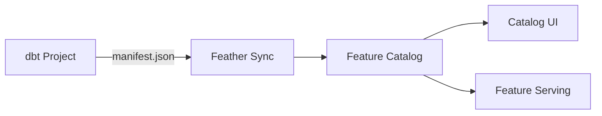
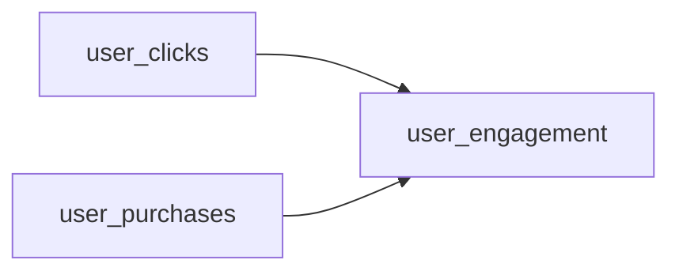

# dbt Integration

Feather integrates with [dbt](https://www.getdbt.com/) to automatically sync your dbt models to the feature catalog. This enables:

- **Automatic feature discovery**: dbt columns become searchable features
- **Lineage tracking**: Model dependencies flow into feature lineage
- **Metadata propagation**: dbt descriptions, tags, and meta become feature metadata
- **Single source of truth**: Define features in dbt, serve them with Feather

## How It Works



1. **dbt generates** a `manifest.json` during `dbt compile` or `dbt run`
2. **Feather parses** the manifest to extract models, columns, and metadata
3. **Features are registered** in the catalog with full lineage
4. **UI and API** expose the features for discovery and serving

## Quick Start

### Option 1: HTTP API

Sync your dbt manifest directly via HTTP:

```bash
# After running dbt
dbt compile

# Sync to Feather
curl -X POST http://localhost:8080/v1/dbt/sync \
  -H "Content-Type: application/json" \
  -d @target/manifest.json
```

### Option 2: Python CLI

Install the `feather-dbt` package:

```bash
pip install feather-dbt
```

Sync your project:

```bash
# From your dbt project directory
feather-dbt sync

# Or specify paths explicitly
feather-dbt sync --manifest target/manifest.json --server http://localhost:8080
```

### Option 3: CI/CD Integration

Add to your dbt pipeline:

```yaml
# .github/workflows/dbt.yml
- name: dbt run
  run: dbt run

- name: Sync to Feather
  run: |
    curl -X POST ${{ secrets.FEATHER_URL }}/v1/dbt/sync \
      -H "Content-Type: application/json" \
      -d @target/manifest.json
```

## Configuration

### Server Configuration

Enable dbt integration in Feather (enabled by default):

```yaml
dbt:
  enabled: true
  default_entity_type: unknown
  owner: data-team@company.com
  team: Data Engineering
  include_sources: false
  include_metrics: false
```

Or via environment variables:

```bash
FEATHER_DBT_ENABLED=true
FEATHER_DBT_DEFAULT_ENTITY_TYPE=unknown
FEATHER_DBT_OWNER=data-team@company.com
FEATHER_DBT_TEAM="Data Engineering"
FEATHER_DBT_INCLUDE_SOURCES=false
FEATHER_DBT_INCLUDE_METRICS=false
```

### Entity Type Mapping

Map dbt tags to Feather entity types:

```yaml
dbt:
  entity_type_mapping:
    user_features: user
    product_features: product
    order_features: order
```

Or use the `entity:` tag prefix in dbt:

```yaml
# models/user_features.yml
models:
  - name: user_features
    tags:
      - entity:user  # Maps to entity_type: user
```

## dbt Model Setup

### Basic Model

```yaml
# models/schema.yml
models:
  - name: user_features
    description: User behavioral features for ML
    tags:
      - entity:user
      - ml
      - real-time
    columns:
      - name: user_id
        description: Primary key
      - name: click_count
        description: Number of clicks in last 24 hours
        data_type: integer
        tags:
          - engagement
      - name: purchase_total
        description: Total purchase amount
        data_type: numeric
```

### With Meta Fields

Use dbt `meta` for additional Feather properties:

```yaml
models:
  - name: user_features
    meta:
      owner: ml-platform@company.com
      team: ML Platform
      category:engagement
    columns:
      - name: click_count
        meta:
          freshness_sla: 5m
          data_source: clickstream
```

### Sources

Include dbt sources in the catalog:

```yaml
# Server config
dbt:
  include_sources: true
```

```yaml
# models/sources.yml
sources:
  - name: raw
    tables:
      - name: clicks
        tags:
          - entity:user
        columns:
          - name: user_id
          - name: clicked_at
          - name: page_url
```

### Metrics

Include dbt metrics:

```yaml
# Server config
dbt:
  include_metrics: true
```

```yaml
# models/metrics.yml
metrics:
  - name: daily_active_users
    label: Daily Active Users
    model: ref('user_activity')
    calculation_method: count_distinct
    expression: user_id
    tags:
      - kpi
      - daily
```

## API Reference

### Sync Manifest

```http
POST /v1/dbt/sync
Content-Type: application/json

{
  "manifest": { ... },  // Full manifest.json content
  "options": {          // Optional overrides
    "default_entity_type": "user",
    "owner": "ml-team@company.com",
    "tags": ["production"],
    "include_sources": true
  }
}
```

**Response:**

```json
{
  "success": true,
  "synced_at": "2024-01-15T10:30:00Z",
  "project_name": "my_dbt_project",
  "manifest_version": "1.7.0",
  "features_created": 45,
  "features_updated": 12,
  "features_skipped": 3,
  "errors": []
}
```

### Validate Manifest

Validate without syncing:

```http
POST /v1/dbt/validate
Content-Type: application/json

{
  "manifest": { ... }
}
```

**Response:**

```json
{
  "valid": true,
  "features": 45,
  "errors": [],
  "project_name": "my_dbt_project"
}
```

### Get Sync Status

```http
GET /v1/dbt/status
```

**Response:**

```json
{
  "last_sync_at": "2024-01-15T10:30:00Z",
  "last_sync_success": true,
  "features_created": 45,
  "features_updated": 12,
  "features_skipped": 3,
  "error_count": 0,
  "project_name": "my_dbt_project",
  "manifest_version": "1.7.0"
}
```

## Python CLI Reference

### Installation

```bash
pip install feather-dbt
```

### Commands

#### sync

Sync dbt manifest to Feather:

```bash
feather-dbt sync [OPTIONS]
```

**Options:**

| Option | Default | Description |
|--------|---------|-------------|
| `--manifest` | `target/manifest.json` | Path to manifest.json |
| `--server` | `http://localhost:8080` | Feather server URL |
| `--api-key` | | API key for authentication |
| `--entity-type` | `unknown` | Default entity type |
| `--owner` | | Default feature owner |
| `--team` | | Default team name |
| `--include-sources` | `false` | Include dbt sources |
| `--include-metrics` | `false` | Include dbt metrics |
| `--tags` | | Additional tags (comma-separated) |
| `--dry-run` | `false` | Validate without syncing |

**Examples:**

```bash
# Basic sync
feather-dbt sync

# With options
feather-dbt sync \
  --server http://feather.prod:8080 \
  --owner data-team@company.com \
  --include-sources

# Dry run
feather-dbt sync --dry-run
```

#### validate

Validate manifest without syncing:

```bash
feather-dbt validate --manifest target/manifest.json
```

#### status

Check sync status:

```bash
feather-dbt status --server http://localhost:8080
```

## Data Type Mapping

dbt/SQL types are mapped to Feather types:

| dbt/SQL Type | Feather Type |
|--------------|--------------|
| `integer`, `int`, `bigint` | `int64` |
| `float`, `double`, `numeric`, `decimal` | `float64` |
| `boolean`, `bool` | `bool` |
| `timestamp`, `datetime`, `date` | `timestamp` |
| `varchar`, `text`, `string` | `string` |
| `array`, `vector` | `vector` |
| `binary`, `blob` | `bytes` |

## Feature Naming

Features are named as `{model_name}.{column_name}`:

```
user_features.click_count
user_features.purchase_total
product_features.embedding
```

For sources: `{source_name}.{table_name}.{column_name}`:

```
raw.clicks.user_id
raw.clicks.clicked_at
```

## Lineage

Feature lineage is derived from dbt's `depends_on`:

```yaml
# user_engagement model depends on user_clicks and user_purchases
models:
  - name: user_engagement
    # dbt tracks: depends_on: ['user_clicks', 'user_purchases']
```

This creates upstream lineage:



View lineage in the Catalog UI or via API:

```bash
curl http://localhost:8080/v1/catalog/features/user_engagement.score/lineage
```

## Best Practices

### 1. Use Consistent Tagging

```yaml
tags:
  - entity:user          # Entity type
  - category:engagement  # Business category
  - ml                   # Use case
  - real-time           # Freshness tier
```

### 2. Document Everything

```yaml
columns:
  - name: churn_score
    description: |
      Probability of user churning in next 30 days.
      Range: 0.0 to 1.0
      Updated: Daily at 2am UTC
      Model: XGBoost v3.2
```

### 3. Use Meta for Ownership

```yaml
models:
  - name: user_features
    meta:
      owner: ml-platform@company.com
      team: ML Platform
      slack: "#ml-platform"
      oncall: ml-platform-oncall
```

### 4. Sync in CI/CD

```yaml
# Run on every merge to main
on:
  push:
    branches: [main]
    paths:
      - 'models/**'
      - 'dbt_project.yml'

jobs:
  sync:
    runs-on: ubuntu-latest
    steps:
      - uses: actions/checkout@v4
      - run: pip install dbt-core feather-dbt
      - run: dbt compile
      - run: feather-dbt sync --server ${{ secrets.FEATHER_URL }}
```

## Troubleshooting

### Sync Fails with "Invalid Manifest"

1. Ensure you've run `dbt compile` or `dbt run` first
2. Check manifest.json exists and is valid JSON
3. Verify dbt version compatibility (1.0+)

### Features Not Appearing

1. Check the sync response for errors
2. Verify model is not disabled (`enabled: false`)
3. Check entity type mapping if filtering by entity

### Lineage Missing

1. Ensure models have `ref()` dependencies
2. Check that upstream models are also synced
3. Verify manifest includes full dependency graph

### Wrong Data Types

1. Explicitly set `data_type` in column definitions
2. Check the [data type mapping](#data-type-mapping) table
3. Use consistent SQL type names across models
