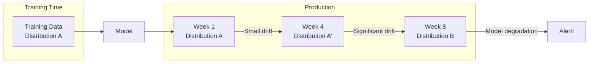

# Drift Detection

Feather includes built-in drift detection to monitor feature distributions and alert you when production data deviates from expected patterns. This helps maintain ML model performance over time.

## Why Drift Detection Matters

ML models are trained on historical data, but production data changes over time:



**Common causes of drift:**
- Seasonal patterns (holiday shopping, weather)
- User behavior changes
- Data pipeline issues
- External events (market shifts, pandemics)

## Enabling Drift Detection

### Configuration

```yaml title="feather.yaml"
drift:
  enabled: true

  # Default settings for all features
  defaults:
    window_size: 1000        # Samples for reference distribution
    detection_method: ks     # Kolmogorov-Smirnov test
    threshold: 0.05          # p-value threshold
    check_interval: 5m       # How often to check

  # Per-feature overrides
  features:
    - name: purchase_total
      threshold: 0.01        # More sensitive for critical features
    - name: click_count
      detection_method: psi  # Use PSI instead
      threshold: 0.1
```

### Registering Features

```bash
# Register a feature for drift monitoring
curl -X POST http://localhost:8080/v1/drift/register \
  -H "Content-Type: application/json" \
  -d '{
    "feature": "user:purchase_total",
    "window_size": 1000,
    "detection_method": "ks",
    "threshold": 0.05
  }'
```

## Detection Methods

### Kolmogorov-Smirnov Test (KS)

Compares cumulative distribution functions. Best for continuous features.

```yaml
drift:
  features:
    - name: purchase_amount
      detection_method: ks
      threshold: 0.05  # p-value threshold
```

**Interpretation:**
- p-value < threshold → Drift detected
- Sensitive to both location and shape changes

### Population Stability Index (PSI)

Measures shift in distributions using binned comparisons. Industry standard for credit scoring.

```yaml
drift:
  features:
    - name: credit_score
      detection_method: psi
      threshold: 0.1  # PSI threshold
```

**PSI Interpretation:**
| PSI Value | Interpretation |
|-----------|----------------|
| < 0.1 | No significant drift |
| 0.1 - 0.25 | Moderate drift, investigate |
| > 0.25 | Significant drift, action needed |

### Jensen-Shannon Divergence (JS)

Symmetric measure of distribution similarity. Works for both continuous and categorical.

```yaml
drift:
  features:
    - name: category_preference
      detection_method: js
      threshold: 0.1
```

## Checking Drift Status

### Get All Status

```bash
curl http://localhost:8080/v1/drift/status
```

**Response:**
```json
{
  "features": [
    {
      "feature": "user:purchase_total",
      "status": "healthy",
      "last_check": "2024-01-15T10:30:00Z",
      "metric_value": 0.02,
      "threshold": 0.05,
      "samples_collected": 1000
    },
    {
      "feature": "user:click_count",
      "status": "drifted",
      "last_check": "2024-01-15T10:30:00Z",
      "metric_value": 0.15,
      "threshold": 0.1,
      "samples_collected": 1000,
      "drift_detected_at": "2024-01-15T10:25:00Z"
    }
  ]
}
```

### Get Alerts

```bash
# Get recent alerts
curl "http://localhost:8080/v1/drift/alerts?since=2024-01-15T00:00:00Z"
```

**Response:**
```json
{
  "alerts": [
    {
      "feature": "user:click_count",
      "detected_at": "2024-01-15T10:25:00Z",
      "detection_method": "psi",
      "metric_value": 0.15,
      "threshold": 0.1,
      "reference_stats": {
        "mean": 45.2,
        "std": 12.3,
        "p50": 42.0
      },
      "current_stats": {
        "mean": 62.8,
        "std": 18.7,
        "p50": 58.0
      }
    }
  ]
}
```

## Resetting Reference Distribution

When drift is expected (e.g., after a product launch), reset the reference:

```bash
curl -X POST http://localhost:8080/v1/drift/reset/user:click_count
```

This captures the current distribution as the new baseline.

## Python SDK

```python
from feather import FeatherClient

client = FeatherClient("localhost:8080")

# Register feature for monitoring
client.drift.register(
    feature="user:purchase_total",
    window_size=1000,
    detection_method="ks",
    threshold=0.05
)

# Check status
status = client.drift.status()
for feature in status.features:
    if feature.status == "drifted":
        print(f"DRIFT DETECTED: {feature.name}")
        print(f"  Metric: {feature.metric_value:.3f} (threshold: {feature.threshold})")

# Get alerts
alerts = client.drift.alerts(since="2024-01-01T00:00:00Z")
for alert in alerts:
    print(f"Alert: {alert.feature} at {alert.detected_at}")
    print(f"  Reference mean: {alert.reference_stats['mean']:.2f}")
    print(f"  Current mean: {alert.current_stats['mean']:.2f}")

# Reset after expected change
client.drift.reset("user:purchase_total")
```

## Go SDK

```go
import "github.com/feather-store/feather/sdk/go/feather"

client, _ := feather.NewClient("localhost:8080")

// Register feature
err := client.Drift.Register(ctx, feather.DriftConfig{
    Feature:         "user:purchase_total",
    WindowSize:      1000,
    DetectionMethod: "ks",
    Threshold:       0.05,
})

// Check status
status, _ := client.Drift.Status(ctx)
for _, f := range status.Features {
    if f.Status == "drifted" {
        log.Printf("DRIFT: %s (%.3f > %.3f)", f.Feature, f.MetricValue, f.Threshold)
    }
}

// Get alerts
alerts, _ := client.Drift.Alerts(ctx, time.Now().Add(-24*time.Hour))
for _, alert := range alerts {
    log.Printf("Alert: %s at %s", alert.Feature, alert.DetectedAt)
}

// Reset reference
err = client.Drift.Reset(ctx, "user:purchase_total")
```

## Alerting Integration

### Prometheus Alerts

```yaml title="alerts.yaml"
groups:
  - name: feather-drift
    rules:
      - alert: FeatureDriftDetected
        expr: feather_drift_detected == 1
        for: 5m
        labels:
          severity: warning
        annotations:
          summary: "Drift detected for feature {{ $labels.feature }}"
          description: "{{ $labels.feature }} has drifted ({{ $labels.method }}: {{ $value }})"

      - alert: FeatureDriftCritical
        expr: feather_drift_metric_value > 0.25
        for: 5m
        labels:
          severity: critical
        annotations:
          summary: "Critical drift for feature {{ $labels.feature }}"
```

### Webhook Notifications

```yaml title="feather.yaml"
drift:
  enabled: true
  notifications:
    webhook:
      url: "https://your-service.com/drift-alerts"
      headers:
        Authorization: "Bearer ${WEBHOOK_TOKEN}"

    slack:
      webhook_url: "${SLACK_WEBHOOK_URL}"
      channel: "#ml-alerts"
```

### Grafana Dashboard

Key panels for drift monitoring:

```promql
# Drift metric over time
feather_drift_metric_value{feature="user:purchase_total"}

# Features currently drifted
count(feather_drift_detected == 1)

# Time since last drift
time() - feather_drift_last_detected_timestamp
```

## Best Practices

### 1. Choose Appropriate Thresholds

```yaml
# Critical model features: stricter thresholds
- name: fraud_score
  threshold: 0.01

# Less critical features: relaxed thresholds
- name: page_views
  threshold: 0.1
```

### 2. Set Window Size Based on Data Volume

```yaml
# High-volume features
- name: click_count
  window_size: 10000  # More samples for stability

# Low-volume features
- name: purchase_total
  window_size: 500    # Smaller window to detect faster
```

### 3. Account for Expected Variations

```python
# Seasonal features: use longer reference windows
client.drift.register(
    feature="holiday_purchases",
    window_size=5000,  # Capture seasonal patterns
    threshold=0.15     # Higher threshold for natural variation
)
```

### 4. Automate Response to Drift

```python
# Example: Automated drift response
def handle_drift_alerts():
    alerts = client.drift.alerts(since=last_check)

    for alert in alerts:
        if alert.metric_value > 0.25:
            # Critical drift: page on-call
            pagerduty.trigger(f"Critical drift: {alert.feature}")

        elif alert.metric_value > 0.1:
            # Moderate drift: create ticket
            jira.create_ticket(
                title=f"Investigate drift: {alert.feature}",
                description=format_drift_report(alert)
            )

        # Log for analysis
        log_drift_event(alert)
```

### 5. Correlate with Model Performance

```python
# Track drift alongside model metrics
drift_status = client.drift.status()
model_metrics = get_model_metrics()

for feature in drift_status.features:
    if feature.status == "drifted":
        # Check if model performance degraded
        if model_metrics.accuracy < baseline_accuracy * 0.95:
            trigger_model_retrain(feature.name)
```

## Troubleshooting

### False Positives

**Symptom:** Drift alerts for features that haven't really changed.

**Solutions:**
1. Increase window size for more stable estimates
2. Increase threshold for noisy features
3. Use PSI instead of KS for high-variance features

### Missed Drift

**Symptom:** Model performance degrades but no drift alerts.

**Solutions:**
1. Lower thresholds for critical features
2. Add monitoring for derived features
3. Monitor feature correlations, not just individual features

### Reference Distribution Issues

**Symptom:** Reference doesn't represent normal behavior.

**Solutions:**
1. Reset reference during known-good period
2. Exclude anomalous periods from reference
3. Use longer window to capture natural variation

## Related Documentation

- [Observability Guide](./observability) - Metrics and alerting
- [Performance Tuning](./performance) - Drift detection overhead
- [Feature Groups](/docs/concepts/feature-groups) - Feature definitions
