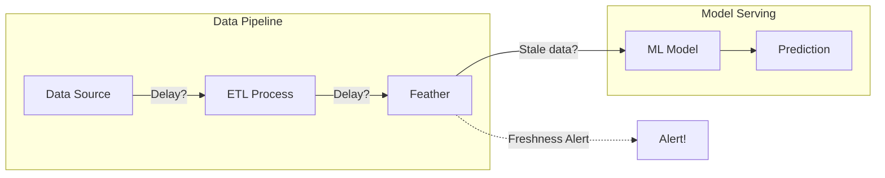

# Feature Freshness

Feature freshness ensures your ML models use up-to-date data. Feather provides built-in freshness monitoring, SLAs, and alerting to help you maintain data quality.

## Why Freshness Matters

Stale features can degrade model performance:



**Impact of stale features:**
- Fraud detection using 6-hour old transaction data
- Recommendations based on yesterday's preferences
- Pricing models with outdated competitor data

## Freshness Configuration

### Per-Feature Freshness SLAs

```yaml title="feather.yaml"
freshness:
  enabled: true

  # Default freshness threshold for all features
  default_max_age: 1h

  # Per-feature overrides
  features:
    # Real-time features: strict freshness
    - name: user:last_activity
      max_age: 5m

    # Near real-time: moderate freshness
    - name: user:click_count
      max_age: 15m

    # Daily features: relaxed freshness
    - name: user:daily_spend
      max_age: 24h

    # Slowly changing: very relaxed
    - name: user:demographics
      max_age: 7d
```

### Per-Feature Group Freshness

```yaml
schema:
  groups:
    - name: real_time_signals
      entity_type: user
      freshness:
        max_age: 5m
        alert_threshold: 10m
      features:
        - name: active_session
        - name: cart_value
        - name: page_views

    - name: daily_aggregates
      entity_type: user
      freshness:
        max_age: 6h
        alert_threshold: 12h
      features:
        - name: daily_purchases
        - name: daily_clicks
```

## Checking Freshness

### HTTP API

```bash
# Get freshness status for all features
curl http://localhost:8080/v1/freshness/status
```

**Response:**
```json
{
  "features": [
    {
      "feature": "user:click_count",
      "entity_count": 1000000,
      "freshness": {
        "min_age_ms": 100,
        "max_age_ms": 890000,
        "avg_age_ms": 45000,
        "p50_age_ms": 30000,
        "p99_age_ms": 600000
      },
      "sla": {
        "max_age_ms": 900000,
        "status": "healthy",
        "entities_stale": 1234,
        "entities_stale_pct": 0.12
      }
    },
    {
      "feature": "user:last_activity",
      "freshness": {
        "avg_age_ms": 450000
      },
      "sla": {
        "max_age_ms": 300000,
        "status": "breached",
        "entities_stale": 50000,
        "entities_stale_pct": 5.0
      }
    }
  ]
}
```

### Check Specific Feature

```bash
curl "http://localhost:8080/v1/freshness/status?feature=user:click_count"
```

### Get Stale Entities

```bash
curl "http://localhost:8080/v1/freshness/stale?feature=user:click_count&limit=100"
```

**Response:**
```json
{
  "feature": "user:click_count",
  "stale_entities": [
    {"entity": "user:123", "age_ms": 1200000, "last_updated": "2024-01-15T10:00:00Z"},
    {"entity": "user:456", "age_ms": 1100000, "last_updated": "2024-01-15T10:01:40Z"}
  ],
  "total_stale": 1234
}
```

## Python SDK

```python
from feather import FeatherClient

client = FeatherClient("localhost:8080")

# Get freshness status
status = client.freshness.status()

for feature in status.features:
    print(f"{feature.name}:")
    print(f"  Avg age: {feature.freshness.avg_age_ms / 1000:.1f}s")
    print(f"  SLA status: {feature.sla.status}")
    if feature.sla.status == "breached":
        print(f"  Stale entities: {feature.sla.entities_stale} ({feature.sla.entities_stale_pct:.2f}%)")

# Check specific feature
click_freshness = client.freshness.status(feature="user:click_count")

# Get stale entities for investigation
stale = client.freshness.get_stale_entities("user:click_count", limit=100)
for entity in stale:
    print(f"  {entity.entity_id}: {entity.age_ms / 1000:.0f}s old")
```

## Go SDK

```go
import "github.com/feather-store/feather/sdk/go/feather"

client, _ := feather.NewClient("localhost:8080")

// Get freshness status
status, err := client.Freshness.Status(ctx)
if err != nil {
    log.Fatal(err)
}

for _, f := range status.Features {
    fmt.Printf("%s: avg age %.1fs, status: %s\n",
        f.Feature,
        float64(f.Freshness.AvgAgeMs)/1000,
        f.SLA.Status)

    if f.SLA.Status == "breached" {
        fmt.Printf("  %d stale entities (%.2f%%)\n",
            f.SLA.EntitiesStale,
            f.SLA.EntitiesStalePct)
    }
}

// Get stale entities
stale, _ := client.Freshness.GetStaleEntities(ctx, "user:click_count", 100)
for _, e := range stale {
    fmt.Printf("  %s: %.0fs old\n", e.Entity, float64(e.AgeMs)/1000)
}
```

## Freshness Monitoring

### Prometheus Metrics

```promql
# Average feature age
feather_feature_age_seconds{feature="user:click_count", quantile="0.5"}

# P99 feature age
feather_feature_age_seconds{feature="user:click_count", quantile="0.99"}

# Percentage of stale entities
feather_feature_stale_entities_percent{feature="user:click_count"}

# SLA breaches
feather_freshness_sla_breached{feature="user:click_count"}
```

### Grafana Dashboard

```promql
# Feature freshness heatmap
feather_feature_age_seconds

# Staleness trend
rate(feather_feature_stale_entities_total[5m])

# SLA compliance percentage
1 - avg(feather_freshness_sla_breached)
```

### Alerting Rules

```yaml title="alerts.yaml"
groups:
  - name: feather-freshness
    rules:
      - alert: FeatureFreshnessSLABreached
        expr: feather_freshness_sla_breached == 1
        for: 5m
        labels:
          severity: warning
        annotations:
          summary: "Freshness SLA breached for {{ $labels.feature }}"
          description: "{{ $labels.feature }} has stale data exceeding SLA"

      - alert: FeatureHighStaleness
        expr: feather_feature_stale_entities_percent > 10
        for: 10m
        labels:
          severity: critical
        annotations:
          summary: "High staleness for {{ $labels.feature }}"
          description: "{{ $value | humanizePercentage }} of entities are stale"

      - alert: FeatureFreshnessP99High
        expr: |
          feather_feature_age_seconds{quantile="0.99"} >
          feather_freshness_max_age_seconds * 0.8
        for: 5m
        labels:
          severity: warning
        annotations:
          summary: "P99 freshness approaching SLA for {{ $labels.feature }}"
```

## Webhook Notifications

```yaml title="feather.yaml"
freshness:
  notifications:
    webhook:
      url: "https://your-service.com/freshness-alerts"
      events:
        - sla_breached
        - sla_recovered

    slack:
      webhook_url: "${SLACK_WEBHOOK_URL}"
      channel: "#data-quality"
      events:
        - sla_breached
```

## Freshness and Model Serving

### Serving-Time Freshness Check

```python
# Include freshness in serving response
features = client.get_features(
    entity="user:123",
    features=["click_count", "purchase_total"],
    include_metadata=True
)

for name, value in features.items():
    age_seconds = value.metadata.age_ms / 1000
    if age_seconds > freshness_threshold:
        # Use fallback or cached value
        log.warning(f"Feature {name} is stale ({age_seconds}s old)")
```

### Graceful Degradation

```python
def get_features_with_fallback(entity_id, features):
    """Get features with freshness-aware fallback."""
    result = client.get_features(
        entity=entity_id,
        features=features,
        include_metadata=True
    )

    for name, value in result.items():
        age_ms = value.metadata.age_ms
        max_age_ms = freshness_config[name]["max_age_ms"]

        if age_ms > max_age_ms:
            # Feature is stale, use fallback strategy
            if name in fallback_values:
                result[name] = fallback_values[name]
            elif name in population_defaults:
                result[name] = population_defaults[name]
            else:
                # Log and use the stale value anyway
                log.warning(f"Using stale {name} for {entity_id}")
                metrics.increment("stale_feature_served", tags={"feature": name})

    return result
```

## Freshness Best Practices

### 1. Set Realistic SLAs

```yaml
# Match SLA to business requirements, not ideal state
features:
  # Fraud detection: needs real-time
  - name: transaction_velocity
    max_age: 1m

  # Recommendations: near real-time is fine
  - name: browsing_history
    max_age: 15m

  # Risk scoring: hourly is acceptable
  - name: credit_indicators
    max_age: 1h
```

### 2. Monitor Ingestion Latency

```promql
# End-to-end latency from source to Feather
feather_ingestion_latency_seconds{source="kafka"}

# If high, investigate upstream pipeline
```

### 3. Separate Critical Features

```yaml
# Critical features on faster pipeline
ingestion:
  kafka:
    topics:
      - name: critical-features
        priority: high
        parallelism: 10
      - name: standard-features
        priority: normal
        parallelism: 4
```

### 4. Alerting Thresholds

```yaml
# Alert before SLA breach
freshness:
  features:
    - name: user:click_count
      max_age: 15m
      warn_threshold: 10m   # Alert at 10m, breach at 15m
      alert_threshold: 12m
```

### 5. Regular Freshness Audits

```python
# Weekly freshness audit
def freshness_audit():
    status = client.freshness.status()

    report = []
    for feature in status.features:
        report.append({
            "feature": feature.name,
            "avg_age_s": feature.freshness.avg_age_ms / 1000,
            "p99_age_s": feature.freshness.p99_age_ms / 1000,
            "sla_max_s": feature.sla.max_age_ms / 1000,
            "headroom_pct": (1 - feature.freshness.p99_age_ms / feature.sla.max_age_ms) * 100,
            "stale_pct": feature.sla.entities_stale_pct
        })

    # Features with less than 20% headroom need attention
    at_risk = [r for r in report if r["headroom_pct"] < 20]
    if at_risk:
        send_audit_report(at_risk)
```

## Troubleshooting

### High Staleness

**Symptom:** Many entities are stale.

**Investigation:**
```bash
# Check ingestion lag
curl http://localhost:8080/v1/ingestion/status

# Check recent ingestion rate
curl http://localhost:8080/v1/metrics | grep feather_features_stored
```

**Common causes:**
- Kafka consumer lag
- Pipeline failures
- Entity no longer active (expected staleness)

### Freshness Spikes

**Symptom:** Periodic freshness degradation.

**Investigation:**
```promql
# Correlate with ingestion patterns
rate(feather_features_stored_total[5m])

# Check for batch processing patterns
```

**Common causes:**
- Batch pipelines with gaps
- Scheduled jobs with long intervals
- GC pauses affecting processing

### SLA Breaches After Deploy

**Symptom:** SLA breaches immediately after deployment.

**Cause:** Cold cache, features need to be re-ingested.

**Solution:**
```yaml
# Warm-up period after deployment
freshness:
  warm_up_period: 10m  # Suppress alerts for 10m after restart
```

## Related Documentation

- [Observability Guide](./observability) - Metrics and alerting
- [Ingestion](/docs/concepts/architecture#ingestion-layer) - Data ingestion patterns
- [Performance Tuning](./performance) - Latency optimization
