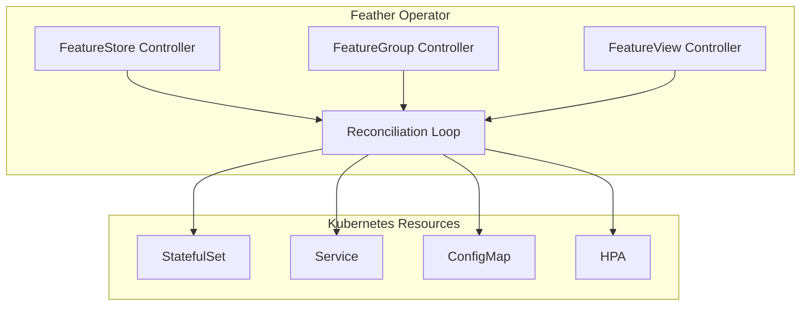

# Kubernetes Operator

Deploy and manage Feather feature stores on Kubernetes with custom resources.

## Overview

The Feather Operator provides Kubernetes-native deployment and management of Feather feature stores. It uses the operator pattern to automate:

- **Deployment**: Manage Feather StatefulSets with proper configuration
- **Scaling**: Horizontal pod autoscaling based on CPU/memory metrics
- **Schema Management**: Synchronize feature group definitions as Kubernetes resources
- **Lifecycle Management**: Handle upgrades, rollbacks, and graceful termination

### Key Features

| Feature | Description |
|---------|-------------|
| **Declarative Configuration** | Define feature stores as Kubernetes custom resources |
| **Auto-scaling** | HPA integration for dynamic scaling based on load |
| **Health Monitoring** | Automatic health checks and status reporting |
| **Rolling Updates** | Zero-downtime upgrades with configurable strategies |
| **Multi-tenancy** | Namespace-scoped resources for team isolation |

## Installation

### Prerequisites

- Kubernetes 1.24+
- kubectl configured with cluster access
- Helm 3.x (optional)

### Install CRDs

```bash
# Apply Custom Resource Definitions
kubectl apply -f deploy/crds/

# Verify CRDs are installed
kubectl get crds | grep feather
```

**Expected output:**
```
featurestores.feather.io       2024-01-15T00:00:00Z
featuregroups.feather.io       2024-01-15T00:00:00Z
featureviews.feather.io        2024-01-15T00:00:00Z
```

### Install Operator

```bash
# Using kubectl
kubectl apply -f deploy/operator/

# Using Helm
helm install feather-operator ./deploy/helm/feather-operator \
  --namespace feather-system \
  --create-namespace
```

### Verify Installation

```bash
kubectl get pods -n feather-system
```

**Expected output:**
```
NAME                                READY   STATUS    RESTARTS   AGE
feather-operator-7d8f9b6c4-x2k9p   1/1     Running   0          30s
```

## Custom Resource Definitions

### FeatureStore

The `FeatureStore` CRD defines a Feather deployment with its configuration.

#### Spec Fields

| Field | Type | Required | Description |
|-------|------|----------|-------------|
| `replicas` | int | No | Number of replicas (default: 1) |
| `image` | string | No | Container image (default: `feather:latest`) |
| `resources` | ResourceRequirements | No | CPU/memory requests and limits |
| `storage` | StorageSpec | No | Storage configuration |
| `autoscaling` | AutoscalingSpec | No | HPA configuration |
| `config` | ConfigSpec | No | Feather application config |

#### Example

```yaml
apiVersion: feather.io/v1alpha1
kind: FeatureStore
metadata:
  name: production-store
  namespace: ml-platform
spec:
  replicas: 3
  image: feather:1.0.0

  resources:
    requests:
      cpu: "2"
      memory: "8Gi"
    limits:
      cpu: "4"
      memory: "16Gi"

  storage:
    hot:
      maxMemory: "6Gi"
      ttl: "2h"
    warm:
      storageClass: "fast-ssd"
      size: "100Gi"

  autoscaling:
    enabled: true
    minReplicas: 2
    maxReplicas: 10
    targetCPUUtilization: 70
    targetMemoryUtilization: 80

  config:
    http:
      port: 8080
      readTimeout: "30s"
    grpc:
      port: 50051
      maxConcurrent: 1000
    metrics:
      enabled: true
      port: 9090
    tracing:
      enabled: true
      endpoint: "jaeger-collector:4317"
      sampleRate: 0.1

  nodeSelector:
    node-type: high-memory

  tolerations:
    - key: "dedicated"
      operator: "Equal"
      value: "ml-serving"
      effect: "NoSchedule"

  affinity:
    podAntiAffinity:
      preferredDuringSchedulingIgnoredDuringExecution:
        - weight: 100
          podAffinityTerm:
            labelSelector:
              matchLabels:
                app: feather
            topologyKey: kubernetes.io/hostname
```

#### Status

```yaml
status:
  phase: Running
  replicas: 3
  readyReplicas: 3
  conditions:
    - type: Available
      status: "True"
      lastTransitionTime: "2024-01-15T10:00:00Z"
    - type: Ready
      status: "True"
      lastTransitionTime: "2024-01-15T10:00:30Z"
  endpoints:
    http: "http://production-store.ml-platform.svc:8080"
    grpc: "production-store.ml-platform.svc:50051"
    metrics: "http://production-store.ml-platform.svc:9090/metrics"
  stats:
    featureCount: 150
    entityCount: 5000000
    requestsPerSecond: 45000
    p99LatencyMs: 0.8
    cacheHitRate: 0.94
```

### FeatureGroup

The `FeatureGroup` CRD defines a collection of related features.

#### Spec Fields

| Field | Type | Required | Description |
|-------|------|----------|-------------|
| `storeRef` | string | Yes | Reference to FeatureStore |
| `entityType` | string | Yes | Entity type (e.g., `user`, `item`) |
| `features` | []FeatureSpec | Yes | List of feature definitions |
| `ttl` | duration | No | Time-to-live for features |
| `sources` | []SourceSpec | No | Data source configurations |
| `owner` | string | No | Team or individual owner |
| `tags` | map[string]string | No | Labels for organization |

#### Example

```yaml
apiVersion: feather.io/v1alpha1
kind: FeatureGroup
metadata:
  name: user-engagement
  namespace: ml-platform
spec:
  storeRef: production-store
  entityType: user
  ttl: "720h"  # 30 days
  owner: "ml-team@example.com"

  tags:
    domain: "user-behavior"
    priority: "critical"
    team: "recommendations"

  features:
    - name: clicks_last_hour
      dataType: int64
      description: "Total clicks in the last hour"
      aggregation:
        function: count
        window: "1h"
        slideBy: "1m"

    - name: purchase_total_7d
      dataType: float64
      description: "Total purchase amount in the last 7 days"
      aggregation:
        function: sum
        window: "168h"
        slideBy: "1h"
      validation:
        min: 0

    - name: favorite_category
      dataType: string
      description: "Most frequent purchase category"
      validation:
        oneOf: ["electronics", "clothing", "books", "home", "other"]

    - name: user_embedding
      dataType: vector
      dimensions: [384]
      description: "User preference embedding from collaborative filtering"

  sources:
    - name: clickstream
      type: kafka
      config:
        topic: "user-clicks"
        brokers: ["kafka:9092"]

    - name: transactions
      type: kafka
      config:
        topic: "purchases"
        brokers: ["kafka:9092"]
```

### FeatureView

The `FeatureView` CRD defines a materialized view combining features from multiple groups.

#### Example

```yaml
apiVersion: feather.io/v1alpha1
kind: FeatureView
metadata:
  name: recommendation-features
  namespace: ml-platform
spec:
  storeRef: production-store

  features:
    - group: user-engagement
      features:
        - clicks_last_hour
        - purchase_total_7d
        - user_embedding

    - group: user-profile
      features:
        - age_bucket
        - location_region

    - group: product-features
      features:
        - product_embedding
        - category
        - price_bucket

  transformations:
    - name: engagement_score
      expression: "clicks_last_hour * 0.3 + log(purchase_total_7d + 1) * 0.7"
      outputType: float64

    - name: user_product_similarity
      expression: "cosine_similarity(user_embedding, product_embedding)"
      outputType: float64

  materialize:
    enabled: true
    schedule: "*/5 * * * *"  # Every 5 minutes
    batchSize: 10000

  ttl: "1h"
```

## Controller Architecture

The Feather Operator implements the Kubernetes controller pattern:



### Reconciliation Flow

1. **Watch**: Controller watches for changes to FeatureStore CRs
2. **Fetch**: Retrieve current state of all managed resources
3. **Compare**: Diff desired state (CR spec) vs actual state
4. **Apply**: Create, update, or delete resources as needed
5. **Status**: Update CR status with current state and conditions

### Phases

| Phase | Description |
|-------|-------------|
| `Pending` | CR created, waiting for resources |
| `Creating` | Resources being created |
| `Running` | All resources healthy and ready |
| `Updating` | Configuration update in progress |
| `Scaling` | Scaling operation in progress |
| `Failed` | Error state, check conditions |
| `Terminating` | Deletion in progress |

## Configuration

### Operator Configuration

```yaml
# ConfigMap for operator settings
apiVersion: v1
kind: ConfigMap
metadata:
  name: feather-operator-config
  namespace: feather-system
data:
  config.yaml: |
    controller:
      reconcileInterval: 30s
      maxConcurrentReconciles: 3
      leaderElection:
        enabled: true
        leaseDuration: 15s
        renewDeadline: 10s
        retryPeriod: 2s

    defaults:
      image: feather:latest
      imagePullPolicy: IfNotPresent
      resources:
        requests:
          cpu: "500m"
          memory: "1Gi"
        limits:
          cpu: "2"
          memory: "4Gi"

    metrics:
      enabled: true
      port: 8383

    webhook:
      enabled: true
      port: 9443
```

## Monitoring

### Operator Metrics

The operator exposes Prometheus metrics on port 8383:

| Metric | Type | Description |
|--------|------|-------------|
| `feather_operator_reconcile_total` | Counter | Total reconciliation attempts |
| `feather_operator_reconcile_errors_total` | Counter | Failed reconciliations |
| `feather_operator_reconcile_duration_seconds` | Histogram | Reconciliation duration |
| `feather_operator_managed_stores` | Gauge | Number of managed FeatureStores |
| `feather_operator_managed_groups` | Gauge | Number of managed FeatureGroups |

### ServiceMonitor

```yaml
apiVersion: monitoring.coreos.com/v1
kind: ServiceMonitor
metadata:
  name: feather-operator
  namespace: feather-system
spec:
  selector:
    matchLabels:
      app: feather-operator
  endpoints:
    - port: metrics
      interval: 30s
```

### Alerts

```yaml
apiVersion: monitoring.coreos.com/v1
kind: PrometheusRule
metadata:
  name: feather-operator-alerts
  namespace: feather-system
spec:
  groups:
    - name: feather-operator
      rules:
        - alert: FeatureStoreNotReady
          expr: |
            feather_store_ready == 0
          for: 5m
          labels:
            severity: critical
          annotations:
            summary: "FeatureStore {{ $labels.name }} is not ready"
            description: "FeatureStore has been unhealthy for more than 5 minutes"

        - alert: HighReconcileErrors
          expr: |
            rate(feather_operator_reconcile_errors_total[5m]) > 0.1
          for: 5m
          labels:
            severity: warning
          annotations:
            summary: "High reconciliation error rate"
            description: "Operator is experiencing frequent reconciliation failures"
```

## Examples

### Minimal Deployment

```yaml
apiVersion: feather.io/v1alpha1
kind: FeatureStore
metadata:
  name: dev-store
spec:
  replicas: 1
---
apiVersion: feather.io/v1alpha1
kind: FeatureGroup
metadata:
  name: user-features
spec:
  storeRef: dev-store
  entityType: user
  features:
    - name: click_count
      dataType: int64
```

### Production Deployment with HA

```yaml
apiVersion: feather.io/v1alpha1
kind: FeatureStore
metadata:
  name: prod-store
spec:
  replicas: 3
  image: feather:1.0.0

  resources:
    requests:
      cpu: "4"
      memory: "16Gi"
    limits:
      cpu: "8"
      memory: "32Gi"

  storage:
    hot:
      maxMemory: "12Gi"
    warm:
      storageClass: "fast-nvme"
      size: "500Gi"

  autoscaling:
    enabled: true
    minReplicas: 3
    maxReplicas: 20
    targetCPUUtilization: 70

  affinity:
    podAntiAffinity:
      requiredDuringSchedulingIgnoredDuringExecution:
        - labelSelector:
            matchLabels:
              feather.io/store: prod-store
          topologyKey: topology.kubernetes.io/zone
```

## Troubleshooting

### Common Issues

#### FeatureStore stuck in Pending

```bash
# Check operator logs
kubectl logs -n feather-system -l app=feather-operator

# Check events
kubectl describe featurestore <name>
```

#### Pod not starting

```bash
# Check pod status
kubectl get pods -l feather.io/store=<name>

# Check pod events
kubectl describe pod <pod-name>
```

#### Schema sync failing

```bash
# Check FeatureGroup status
kubectl get featuregroup <name> -o yaml

# Check controller logs
kubectl logs -n feather-system -l app=feather-operator | grep "featuregroup"
```

### Debug Commands

```bash
# List all FeatureStores
kubectl get featurestores -A

# Get detailed status
kubectl get featurestore <name> -o jsonpath='{.status}'

# Watch reconciliation
kubectl logs -n feather-system -l app=feather-operator -f
```

## Related Documentation

- [Architecture Overview](../concepts/architecture) - System design
- [Deployment Guide](./deployment) - Manual deployment options
- [API Reference](../api-reference) - HTTP and gRPC APIs
