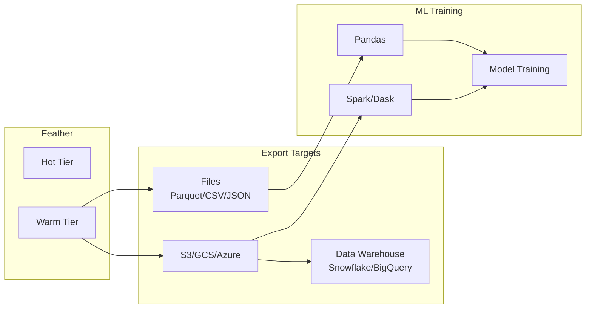

# Offline Sync & Export

Feather supports exporting feature data for offline training, data warehousing, and batch processing. This guide covers the export formats, APIs, and integration patterns.

## Overview



## Export Formats

| Format | Use Case | Compression | Schema |
|--------|----------|-------------|--------|
| **Parquet** | Large datasets, Spark | Snappy/ZSTD | Embedded |
| **CSV** | Simple, universal | gzip | Header row |
| **JSON** | Flexible, debugging | gzip | Self-describing |
| **JSONL** | Streaming, logs | gzip | Self-describing |

## Export API

### Full Export

Export all features for specified entities:

```bash
curl -X POST http://localhost:8080/v1/export \
  -H "Content-Type: application/json" \
  -d '{
    "format": "parquet",
    "entities": ["user:*"],
    "features": ["click_count", "purchase_total", "last_activity"],
    "output_path": "/exports/features.parquet"
  }'
```

### Time-Range Export

Export features within a time window:

```bash
curl -X POST http://localhost:8080/v1/export \
  -H "Content-Type: application/json" \
  -d '{
    "format": "parquet",
    "entities": ["user:*"],
    "features": ["click_count", "purchase_total"],
    "start_time": "2024-01-01T00:00:00Z",
    "end_time": "2024-01-31T23:59:59Z",
    "output_path": "s3://bucket/exports/january.parquet"
  }'
```

### Point-in-Time Export

Export features at specific timestamps for training data:

```bash
curl -X POST http://localhost:8080/v1/export/pit \
  -H "Content-Type: application/json" \
  -d '{
    "format": "parquet",
    "queries": [
      {"entity": "user:123", "as_of": "2024-01-15T00:00:00Z"},
      {"entity": "user:456", "as_of": "2024-01-16T00:00:00Z"},
      {"entity": "user:789", "as_of": "2024-01-17T00:00:00Z"}
    ],
    "features": ["click_count", "purchase_total", "days_since_signup"],
    "output_path": "/exports/training_data.parquet"
  }'
```

### Export Response

```json
{
  "export_id": "exp-a1b2c3d4",
  "status": "completed",
  "output_path": "s3://bucket/exports/january.parquet",
  "stats": {
    "rows_exported": 1000000,
    "file_size_bytes": 52428800,
    "duration_ms": 12500
  }
}
```

## Python SDK

### Basic Export

```python
from feather import FeatherClient

client = FeatherClient("localhost:8080")

# Export to local file
result = client.export(
    format="parquet",
    entities=["user:*"],
    features=["click_count", "purchase_total"],
    output_path="/data/features.parquet"
)

print(f"Exported {result.rows_exported} rows to {result.output_path}")

# Read with pandas
import pandas as pd
df = pd.read_parquet("/data/features.parquet")
```

### Training Data Generation

```python
import pandas as pd
from feather import FeatherClient

client = FeatherClient("localhost:8080")

# Your labels with timestamps
labels = pd.DataFrame({
    "entity": ["user:123", "user:456", "user:789"],
    "label_time": ["2024-01-15", "2024-01-16", "2024-01-17"],
    "churned": [1, 0, 1]
})

# Export point-in-time features
queries = [
    {"entity": row["entity"], "as_of": row["label_time"]}
    for _, row in labels.iterrows()
]

result = client.export_pit(
    format="parquet",
    queries=queries,
    features=["click_count", "purchase_total", "days_since_signup"],
    output_path="/data/training_features.parquet"
)

# Merge with labels
features = pd.read_parquet("/data/training_features.parquet")
training_data = labels.merge(features, on="entity")

# Ready for training!
print(training_data.head())
```

### Export to Cloud Storage

```python
# Export to S3
result = client.export(
    format="parquet",
    entities=["user:*"],
    features=["click_count", "purchase_total"],
    output_path="s3://my-bucket/exports/features.parquet",
    credentials={
        "aws_access_key_id": "${AWS_ACCESS_KEY_ID}",
        "aws_secret_access_key": "${AWS_SECRET_ACCESS_KEY}"
    }
)

# Export to GCS
result = client.export(
    format="parquet",
    entities=["user:*"],
    features=["click_count", "purchase_total"],
    output_path="gs://my-bucket/exports/features.parquet",
    credentials={
        "google_application_credentials": "/path/to/credentials.json"
    }
)
```

## Go SDK

```go
import "github.com/feather-store/feather/sdk/go/feather"

client, _ := feather.NewClient("localhost:8080")

// Basic export
result, err := client.Export(ctx, feather.ExportRequest{
    Format:     "parquet",
    Entities:   []string{"user:*"},
    Features:   []string{"click_count", "purchase_total"},
    OutputPath: "/data/features.parquet",
})

if err != nil {
    log.Fatal(err)
}

fmt.Printf("Exported %d rows\n", result.RowsExported)

// Point-in-time export
queries := []feather.PITQuery{
    {Entity: "user:123", AsOf: time.Date(2024, 1, 15, 0, 0, 0, 0, time.UTC)},
    {Entity: "user:456", AsOf: time.Date(2024, 1, 16, 0, 0, 0, 0, time.UTC)},
}

result, err = client.ExportPIT(ctx, feather.PITExportRequest{
    Format:     "parquet",
    Queries:    queries,
    Features:   []string{"click_count", "purchase_total"},
    OutputPath: "/data/training.parquet",
})
```

## Scheduled Exports

### Configuration

Set up automated exports on a schedule:

```yaml title="feather.yaml"
export:
  schedules:
    - name: daily_snapshot
      cron: "0 2 * * *"  # 2 AM daily
      format: parquet
      entities: ["user:*"]
      features: ["click_count", "purchase_total", "last_activity"]
      output_path: "s3://bucket/snapshots/{{.Date}}/features.parquet"
      retention: 30d  # Keep 30 days of snapshots

    - name: hourly_incremental
      cron: "0 * * * *"  # Every hour
      format: parquet
      entities: ["user:*"]
      features: ["click_count"]
      time_range: 1h  # Last hour's data
      output_path: "s3://bucket/incremental/{{.DateTime}}.parquet"
      retention: 7d
```

### Template Variables

| Variable | Description | Example |
|----------|-------------|---------|
| `{{.Date}}` | Date (YYYY-MM-DD) | 2024-01-15 |
| `{{.DateTime}}` | Datetime (YYYY-MM-DD-HH) | 2024-01-15-14 |
| `{{.Timestamp}}` | Unix timestamp | 1705334400 |
| `{{.Year}}` | Year | 2024 |
| `{{.Month}}` | Month | 01 |
| `{{.Day}}` | Day | 15 |

## Data Warehouse Integration

### Snowflake

```sql
-- Create external stage pointing to Feather exports
CREATE OR REPLACE STAGE feather_exports
  URL = 's3://bucket/exports/'
  CREDENTIALS = (AWS_KEY_ID = '...' AWS_SECRET_KEY = '...');

-- Create table from Parquet
CREATE OR REPLACE TABLE features AS
SELECT *
FROM @feather_exports/features.parquet
(FILE_FORMAT => 'parquet_format');

-- Scheduled refresh
CREATE OR REPLACE TASK refresh_features
  WAREHOUSE = compute_wh
  SCHEDULE = 'USING CRON 0 3 * * * UTC'
AS
  COPY INTO features
  FROM @feather_exports/daily/
  FILE_FORMAT = (TYPE = PARQUET)
  PATTERN = '.*parquet';
```

### BigQuery

```bash
# Load Parquet from GCS
bq load \
  --source_format=PARQUET \
  --autodetect \
  mydataset.features \
  gs://bucket/exports/features.parquet

# Create external table
bq mk \
  --external_table_definition=@PARQUET=gs://bucket/exports/*.parquet \
  mydataset.features_external
```

### Databricks

```python
# Read Feather exports in Databricks
df = spark.read.parquet("s3://bucket/exports/features.parquet")

# Create Delta table
df.write.format("delta").saveAsTable("features")

# Scheduled notebook to refresh
dbutils.notebook.run("refresh_features", timeout_seconds=3600)
```

## Incremental Export

For large datasets, use incremental exports:

```yaml title="feather.yaml"
export:
  incremental:
    enabled: true
    checkpoint_path: "/var/lib/feather/export_checkpoints"

  schedules:
    - name: incremental_sync
      cron: "*/15 * * * *"  # Every 15 minutes
      mode: incremental     # Only export changes
      format: parquet
      entities: ["user:*"]
      output_path: "s3://bucket/incremental/{{.DateTime}}.parquet"
```

### Checkpoint Management

```bash
# View checkpoint status
curl http://localhost:8080/v1/export/checkpoints

# Reset checkpoint (re-export all)
curl -X DELETE http://localhost:8080/v1/export/checkpoints/incremental_sync
```

## Performance Optimization

### Parallel Export

```yaml
export:
  parallelism: 8         # Export workers
  batch_size: 10000      # Rows per batch
  buffer_size: "256MB"   # Memory buffer
```

### Compression Settings

| Format | Compression | Ratio | Speed |
|--------|-------------|-------|-------|
| Parquet + Snappy | Fast | ~3x | Fastest |
| Parquet + ZSTD | Better | ~5x | Fast |
| CSV + gzip | Good | ~4x | Slow |

```yaml
export:
  parquet:
    compression: zstd
    row_group_size: 100000
```

### Export Monitoring

```promql
# Export throughput
rate(feather_export_rows_total[5m])

# Export duration
histogram_quantile(0.99, rate(feather_export_duration_seconds_bucket[5m]))

# Failed exports
rate(feather_export_errors_total[5m])
```

## Best Practices

### 1. Use Parquet for Large Datasets

```python
# Good: Parquet for analytics
client.export(format="parquet", ...)  # Columnar, compressed

# Avoid: CSV for large datasets
client.export(format="csv", ...)  # Slower, larger files
```

### 2. Partition by Date

```yaml
# Good: Partitioned exports
output_path: "s3://bucket/features/date={{.Date}}/data.parquet"

# Enables efficient queries:
# SELECT * FROM features WHERE date = '2024-01-15'
```

### 3. Match Export Schedule to Training

```yaml
# If training runs daily at 6 AM
export:
  schedules:
    - name: training_data
      cron: "0 5 * * *"  # Export at 5 AM, before training
```

### 4. Validate Exports

```python
# Validate export completeness
result = client.export(...)

# Check row counts match expectations
expected_rows = client.get_entity_count("user:*")
if result.rows_exported < expected_rows * 0.99:
    raise ValueError(f"Export incomplete: {result.rows_exported}/{expected_rows}")
```

## Related Documentation

- [Point-in-Time Queries](/docs/concepts/point-in-time) - Historical feature retrieval
- [Tiered Storage](/docs/concepts/tiered-storage) - How data is stored
- [Performance Tuning](./performance) - Export optimization
