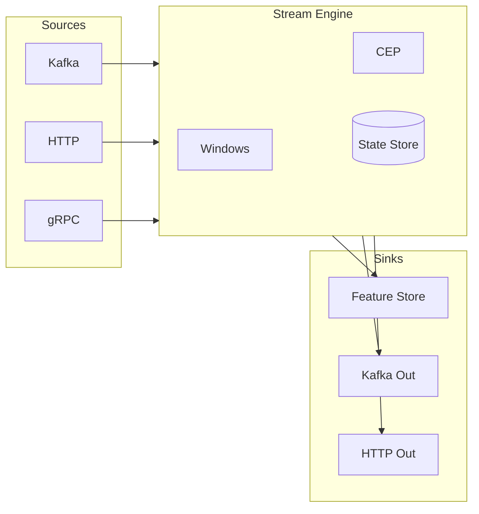

# Real-Time Streaming

Build streaming feature pipelines with windowed aggregations and complex event processing.

## Overview

The streaming package enables real-time feature computation from event streams. It provides:

- **Event-Time Processing**: Handle out-of-order events with watermarks
- **Windowed Aggregations**: Tumbling, sliding, and session windows
- **Stream Transformations**: Map, filter, flatMap, and custom operators
- **Complex Event Processing**: Pattern detection across event sequences
- **Stream Joins**: Combine multiple streams by key

### Key Features

| Feature | Description |
|---------|-------------|
| **Low Latency** | Sub-second feature updates |
| **Exactly-Once** | Guaranteed processing semantics |
| **Backpressure** | Automatic flow control |
| **Fault Tolerance** | Checkpoint-based recovery |
| **Scalable** | Horizontal partitioning |

## Architecture



### Components

| Component | Purpose |
|-----------|---------|
| **Source** | Ingests events from external systems |
| **Processor** | Transforms and enriches events |
| **Window** | Groups events by time for aggregation |
| **CEP Engine** | Detects complex patterns |
| **State Store** | Maintains processing state |
| **Sink** | Outputs results to destinations |

## Stream Processors

### Built-in Processors

#### Map

Transform each event:

```go
stream.Map(func(event Event) Event {
    event.Data["processed"] = true
    event.Data["normalized_value"] = event.Data["value"].(float64) / 100.0
    return event
})
```

#### Filter

Select events matching criteria:

```go
stream.Filter(func(event Event) bool {
    return event.Data["type"] == "purchase" &&
           event.Data["amount"].(float64) > 100.0
})
```

#### FlatMap

One-to-many transformation:

```go
stream.FlatMap(func(event Event) []Event {
    items := event.Data["items"].([]interface{})
    events := make([]Event, len(items))
    for i, item := range items {
        events[i] = Event{
            Key:       event.Key,
            Timestamp: event.Timestamp,
            Data:      item.(map[string]interface{}),
        }
    }
    return events
})
```

#### KeyBy

Partition by key for stateful operations:

```go
stream.KeyBy(func(event Event) string {
    return event.Data["user_id"].(string)
})
```

### Custom Processors

Implement the `Processor` interface:

```go
type Processor interface {
    Process(ctx context.Context, event Event) ([]Event, error)
    Init(ctx context.Context) error
    Close() error
}

// Example: Enrichment processor
type UserEnricher struct {
    userService UserService
}

func (e *UserEnricher) Process(ctx context.Context, event Event) ([]Event, error) {
    userID := event.Data["user_id"].(string)
    user, err := e.userService.Get(ctx, userID)
    if err != nil {
        return nil, err
    }
    event.Data["user_segment"] = user.Segment
    event.Data["user_tier"] = user.Tier
    return []Event{event}, nil
}
```

## Windowing

### Window Types

#### Tumbling Windows

Fixed-size, non-overlapping windows:

```go
stream.
    KeyBy(userKey).
    Window(TumblingWindow(5 * time.Minute)).
    Aggregate(Count())
```

```
Time:    |----5m----|----5m----|----5m----|
Events:  | * * * *  |  * * *   | * * * * *|
Windows: |  Win 1   |  Win 2   |  Win 3   |
```

#### Sliding Windows

Fixed-size, overlapping windows:

```go
stream.
    KeyBy(userKey).
    Window(SlidingWindow(1 * time.Hour, 5 * time.Minute)).
    Aggregate(Sum("amount"))
```

```
Time:    |----1h window 1--------|
         |     |----1h window 2--------|
         |     |     |----1h window 3--------|
Slide:   |--5m-|--5m-|--5m-|
```

#### Session Windows

Dynamic windows based on activity gaps:

```go
stream.
    KeyBy(userKey).
    Window(SessionWindow(30 * time.Minute)).
    Aggregate(Count())
```

```
Events:  * * *           * *       * * * *
         |---|           |-|       |-----|
       Session 1      Session 2   Session 3
         (gap > 30m)
```

### Window Configuration

```go
type WindowConfig struct {
    Type            WindowType    // Tumbling, Sliding, Session
    Size            time.Duration // Window size
    Slide           time.Duration // Slide interval (sliding only)
    Gap             time.Duration // Inactivity gap (session only)
    AllowedLateness time.Duration // Late event tolerance
    Trigger         TriggerType   // When to emit results
}
```

### Aggregation Functions

| Function | Description |
|----------|-------------|
| `Count()` | Number of events in window |
| `Sum(field)` | Sum of numeric field |
| `Avg(field)` | Average of numeric field |
| `Min(field)` | Minimum value |
| `Max(field)` | Maximum value |
| `First()` | First event in window |
| `Last()` | Last event in window |
| `Collect()` | All events as list |
| `Distinct(field)` | Unique values count |

### Custom Aggregations

```go
type Aggregator interface {
    Init() interface{}                            // Initial accumulator
    Add(acc interface{}, event Event) interface{} // Add event
    Merge(acc1, acc2 interface{}) interface{}     // Merge accumulators
    Result(acc interface{}) interface{}           // Extract result
}

// Example: Percentile aggregator
type PercentileAggregator struct {
    Field      string
    Percentile float64
}

func (p *PercentileAggregator) Init() interface{} {
    return []float64{}
}

func (p *PercentileAggregator) Add(acc interface{}, event Event) interface{} {
    values := acc.([]float64)
    value := event.Data[p.Field].(float64)
    return append(values, value)
}

func (p *PercentileAggregator) Result(acc interface{}) interface{} {
    values := acc.([]float64)
    sort.Float64s(values)
    idx := int(float64(len(values)) * p.Percentile)
    return values[idx]
}
```

## Complex Event Processing

Detect patterns across event sequences.

### Pattern Definition

```go
// Detect: login -> (multiple failed attempts) -> successful login
pattern := Pattern().
    Begin("login_attempt").
    Where(func(e Event) bool {
        return e.Data["event_type"] == "login_attempt"
    }).
    FollowedBy("failures").
    Where(func(e Event) bool {
        return e.Data["event_type"] == "login_failed"
    }).
    Times(3, 10). // 3 to 10 failures
    FollowedBy("success").
    Where(func(e Event) bool {
        return e.Data["event_type"] == "login_success"
    }).
    Within(5 * time.Minute)
```

### Pattern Operators

| Operator | Description |
|----------|-------------|
| `Begin(name)` | Start pattern with named state |
| `FollowedBy(name)` | Strict sequence (no events between) |
| `FollowedByAny(name)` | Relaxed sequence (allows other events) |
| `Where(predicate)` | Condition for matching |
| `Times(min, max)` | Repetition count |
| `Within(duration)` | Maximum pattern duration |
| `Until(predicate)` | Stop condition |

### Pattern Actions

```go
cep := NewCEPEngine()

cep.RegisterPattern("suspicious_login", pattern, func(match PatternMatch) {
    userID := match.Events["login_attempt"][0].Data["user_id"].(string)
    failCount := len(match.Events["failures"])

    // Emit alert
    alertSink.Send(Alert{
        Type:    "suspicious_login",
        UserID:  userID,
        Details: fmt.Sprintf("%d failed attempts before success", failCount),
    })

    // Update feature
    store.Put(ctx, "user:"+userID, map[string]*FeatureValue{
        "suspicious_login_count": {Value: int64(1), Timestamp: time.Now().UnixNano()},
    })
})
```

### Built-in Patterns

```go
// Rapid sequence detection
RapidEventsPattern(eventType string, count int, window time.Duration)

// Absence detection (event didn't happen)
AbsencePattern(eventType string, afterEvent string, timeout time.Duration)

// Trend detection (increasing/decreasing values)
TrendPattern(field string, direction TrendDirection, minEvents int)
```

## Stream Joins

Combine events from multiple streams.

### Join Types

#### Inner Join

Only matching events from both streams:

```go
clicks := kafkaSource("clicks")
purchases := kafkaSource("purchases")

clicks.
    KeyBy(userKey).
    Join(purchases.KeyBy(userKey)).
    Window(TumblingWindow(1 * time.Hour)).
    Apply(func(click, purchase Event) Event {
        return Event{
            Key: click.Key,
            Data: map[string]interface{}{
                "user_id":         click.Data["user_id"],
                "click_timestamp": click.Timestamp,
                "purchase_amount": purchase.Data["amount"],
                "conversion_time": purchase.Timestamp - click.Timestamp,
            },
        }
    })
```

#### Left Join

All events from left stream, matching from right:

```go
clicks.
    KeyBy(userKey).
    LeftJoin(purchases.KeyBy(userKey)).
    Window(TumblingWindow(1 * time.Hour)).
    Apply(func(click Event, purchase *Event) Event {
        converted := purchase != nil
        var amount float64
        if converted {
            amount = purchase.Data["amount"].(float64)
        }
        return Event{
            Key: click.Key,
            Data: map[string]interface{}{
                "user_id":   click.Data["user_id"],
                "converted": converted,
                "amount":    amount,
            },
        }
    })
```

#### Interval Join

Join based on time proximity:

```go
clicks.
    KeyBy(userKey).
    IntervalJoin(purchases.KeyBy(userKey)).
    Between(-5*time.Minute, 30*time.Minute). // Purchase 5min before to 30min after click
    Apply(func(click, purchase Event) Event {
        return Event{
            Key: click.Key,
            Data: map[string]interface{}{
                "click_to_purchase_ms": purchase.Timestamp - click.Timestamp,
            },
        }
    })
```

### Broadcast Join

Join stream with slowly-changing dimension data:

```go
// Broadcast user profiles to all partitions
profiles := kafkaSource("user_profiles").Broadcast()

events.
    KeyBy(userKey).
    Connect(profiles).
    Process(&EnrichWithProfile{})
```

## Configuration

### Full Configuration

```yaml
streaming:
  # Engine settings
  engine:
    parallelism: 8                    # Number of parallel tasks
    checkpoint_interval: "1m"         # State checkpoint frequency
    checkpoint_storage: "/var/lib/feather/checkpoints"

  # Watermark settings (for event-time processing)
  watermark:
    strategy: "bounded_out_of_orderness"
    max_out_of_orderness: "5s"        # How late events can be
    idle_timeout: "1m"                # Advance watermark if source idle

  # Windowing defaults
  windows:
    default_allowed_lateness: "1m"
    default_trigger: "event_time"     # or "processing_time", "count"

  # State backend
  state:
    backend: "rocksdb"                # or "memory"
    rocksdb_path: "/var/lib/feather/state"
    ttl: "24h"                        # State cleanup

  # Backpressure
  backpressure:
    strategy: "block"                 # or "drop", "sample"
    buffer_size: 10000
    high_watermark: 0.8
    low_watermark: 0.5

  # Sources
  sources:
    kafka:
      brokers: ["kafka:9092"]
      consumer_group: "feather-streaming"
      auto_offset_reset: "latest"

  # Sinks
  sinks:
    feature_store:
      batch_size: 100
      flush_interval: "100ms"
```

### Pipeline Definition (YAML)

```yaml
# streaming-pipeline.yaml
apiVersion: feather.io/v1
kind: StreamingPipeline
metadata:
  name: user-engagement-pipeline
spec:
  source:
    type: kafka
    config:
      topic: "user-events"

  steps:
    - name: filter-clicks
      type: filter
      config:
        expression: "event_type == 'click'"

    - name: key-by-user
      type: keyBy
      config:
        key: "user_id"

    - name: hourly-window
      type: window
      config:
        type: tumbling
        size: "1h"

    - name: count-clicks
      type: aggregate
      config:
        function: count
        output_feature: "clicks_last_hour"

  sink:
    type: feature_store
    config:
      entity_type: "user"
```

## Examples

### Click-Through Rate Calculation

```go
func buildCTRPipeline(engine *streaming.Engine) {
    impressions := engine.Source("impressions_topic")
    clicks := engine.Source("clicks_topic")

    // Count impressions per ad per hour
    impressionCounts := impressions.
        KeyBy(func(e Event) string {
            return e.Data["ad_id"].(string)
        }).
        Window(TumblingWindow(1 * time.Hour)).
        Aggregate(Count())

    // Count clicks per ad per hour
    clickCounts := clicks.
        KeyBy(func(e Event) string {
            return e.Data["ad_id"].(string)
        }).
        Window(TumblingWindow(1 * time.Hour)).
        Aggregate(Count())

    // Join and calculate CTR
    impressionCounts.
        Join(clickCounts).
        Window(TumblingWindow(1 * time.Hour)).
        Apply(func(imp, click Event) Event {
            impCount := imp.Data["count"].(int64)
            clickCount := click.Data["count"].(int64)
            ctr := float64(clickCount) / float64(impCount)

            return Event{
                Key: imp.Key,
                Data: map[string]interface{}{
                    "ad_id":       imp.Key,
                    "impressions": impCount,
                    "clicks":      clickCount,
                    "ctr":         ctr,
                },
            }
        }).
        Sink(FeatureStoreSink("ad", []string{"impressions", "clicks", "ctr"}))
}
```

### Fraud Detection Pipeline

```go
func buildFraudDetectionPipeline(engine *streaming.Engine) {
    transactions := engine.Source("transactions_topic")

    // Detect rapid transactions (velocity check)
    rapidTransactions := transactions.
        KeyBy(userKey).
        Window(SlidingWindow(5*time.Minute, 1*time.Minute)).
        Aggregate(Count()).
        Filter(func(e Event) bool {
            return e.Data["count"].(int64) > 10
        })

    // Detect unusual amounts
    unusualAmounts := transactions.
        KeyBy(userKey).
        Window(SlidingWindow(24*time.Hour, 1*time.Hour)).
        Aggregate(&StdDevAggregator{Field: "amount"}).
        Process(&AnomalyDetector{Threshold: 3.0}) // 3 std devs

    // Detect geographic anomalies
    geoAnomalies := transactions.
        KeyBy(userKey).
        Window(SessionWindow(30*time.Minute)).
        Process(&GeoVelocityChecker{MaxSpeedKmH: 500})

    // Combine signals
    Union(rapidTransactions, unusualAmounts, geoAnomalies).
        KeyBy(userKey).
        Window(TumblingWindow(5*time.Minute)).
        Aggregate(Collect()).
        Process(&FraudScorer{}).
        Sink(AlertSink("fraud_alerts"))
}
```

### Session Analytics

```go
func buildSessionPipeline(engine *streaming.Engine) {
    pageViews := engine.Source("page_views_topic")

    pageViews.
        KeyBy(func(e Event) string {
            return e.Data["session_id"].(string)
        }).
        Window(SessionWindow(30 * time.Minute)).
        Aggregate(&SessionAggregator{}).
        Map(func(e Event) Event {
            // Calculate session metrics
            events := e.Data["events"].([]Event)
            duration := events[len(events)-1].Timestamp - events[0].Timestamp

            pages := make(map[string]bool)
            for _, ev := range events {
                pages[ev.Data["page"].(string)] = true
            }

            return Event{
                Key: e.Data["user_id"].(string),
                Data: map[string]interface{}{
                    "session_duration_ms": duration,
                    "page_views":          len(events),
                    "unique_pages":        len(pages),
                    "bounce":              len(events) == 1,
                },
            }
        }).
        Sink(FeatureStoreSink("user", []string{
            "session_duration_ms",
            "page_views",
            "unique_pages",
            "bounce",
        }))
}
```

## Monitoring

### Metrics

| Metric | Type | Description |
|--------|------|-------------|
| `streaming_events_processed_total` | Counter | Total events processed |
| `streaming_events_per_second` | Gauge | Current throughput |
| `streaming_latency_ms` | Histogram | Processing latency |
| `streaming_watermark_lag_ms` | Gauge | Event time lag |
| `streaming_backpressure_ratio` | Gauge | Buffer utilization |
| `streaming_checkpoint_duration_ms` | Histogram | Checkpoint time |
| `streaming_window_count` | Gauge | Active windows |

### Dashboard Queries

```promql
# Throughput
rate(streaming_events_processed_total[1m])

# P99 latency
histogram_quantile(0.99, rate(streaming_latency_ms_bucket[5m]))

# Backpressure alert
streaming_backpressure_ratio > 0.9

# Watermark lag
streaming_watermark_lag_ms > 60000
```

### Health Checks

```bash
# Check streaming status
curl http://localhost:8080/v1/streaming/status

# Response
{
  "status": "healthy",
  "pipelines": {
    "user-engagement": {
      "status": "running",
      "throughput": 15000,
      "latency_p99_ms": 45,
      "watermark_lag_ms": 2500,
      "active_windows": 1250
    }
  }
}
```

## Related Documentation

- [Architecture Overview](../concepts/architecture) - System design
- [Deployment Guide](./deployment) - Kafka configuration
