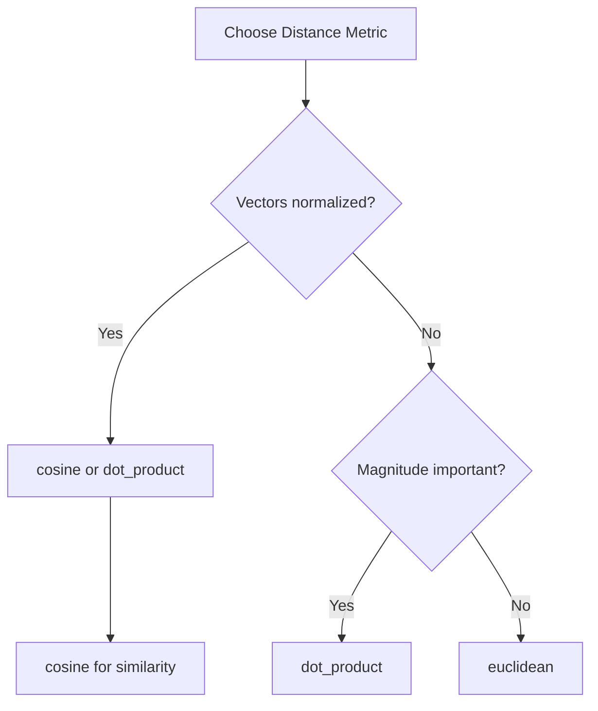

# Vector Similarity Search

Feather includes a built-in vector similarity search engine for building recommendation systems, semantic search, and other ML applications that require finding similar items.

## Overview

Vector search finds the nearest neighbors to a query vector using approximate nearest neighbor (ANN) algorithms. Feather uses HNSW (Hierarchical Navigable Small World) for fast, accurate similarity search.

| Feature | Specification |
|---------|---------------|
| **Algorithm** | HNSW (Hierarchical Navigable Small World) |
| **Distance Metrics** | Cosine, Euclidean, Dot Product |
| **Max Dimensions** | 4096 |
| **Latency** | Sub-millisecond for 1M vectors |

## Creating a Vector Index

### Via HTTP API

```bash
curl -X POST http://localhost:8080/v1/vectors \
  -H "Content-Type: application/json" \
  -d '{
    "name": "product_embeddings",
    "dimensions": 384,
    "metric": "cosine",
    "hnsw": {
      "m": 16,
      "ef_construction": 200
    }
  }'
```

### Via Configuration

```yaml title="feather.yaml"
vectors:
  indexes:
    - name: product_embeddings
      dimensions: 384
      metric: cosine
      hnsw:
        m: 16
        ef_construction: 200

    - name: user_embeddings
      dimensions: 768
      metric: dot_product
      hnsw:
        m: 32
        ef_construction: 400
```

## Distance Metrics

| Metric | Use Case | Range |
|--------|----------|-------|
| `cosine` | Text embeddings, normalized vectors | 0 to 2 |
| `euclidean` | Image embeddings, spatial data | 0 to ∞ |
| `dot_product` | When magnitude matters | -∞ to ∞ |

### Choosing a Metric



## HNSW Parameters

### Construction Parameters

| Parameter | Default | Description |
|-----------|---------|-------------|
| `m` | 16 | Connections per node (higher = better recall, more memory) |
| `ef_construction` | 200 | Build-time search width (higher = better index quality) |

### Search Parameters

| Parameter | Default | Description |
|-----------|---------|-------------|
| `ef_search` | 100 | Query-time search width (higher = better recall, slower) |

### Tuning Guidelines

| Use Case | m | ef_construction | ef_search |
|----------|---|-----------------|-----------|
| **Low latency** | 12 | 100 | 50 |
| **Balanced** | 16 | 200 | 100 |
| **High recall** | 32 | 400 | 200 |

## Upserting Vectors

### Single Vector

```bash
curl -X POST http://localhost:8080/v1/vectors/product_embeddings/upsert \
  -H "Content-Type: application/json" \
  -d '{
    "vectors": [
      {
        "id": "product:123",
        "values": [0.1, 0.2, 0.3, ...],
        "metadata": {
          "category": "electronics",
          "price": 299.99
        }
      }
    ]
  }'
```

### Batch Upsert

```bash
curl -X POST http://localhost:8080/v1/vectors/product_embeddings/upsert \
  -H "Content-Type: application/json" \
  -d '{
    "vectors": [
      {"id": "product:123", "values": [0.1, 0.2, ...]},
      {"id": "product:124", "values": [0.3, 0.4, ...]},
      {"id": "product:125", "values": [0.5, 0.6, ...]}
    ]
  }'
```

### Python SDK

```python
from feather import FeatherClient

client = FeatherClient("localhost:8080")

# Upsert vectors
client.vectors.upsert(
    index="product_embeddings",
    vectors=[
        {
            "id": "product:123",
            "values": embedding_model.encode("Wireless headphones"),
            "metadata": {"category": "electronics", "price": 299.99}
        },
        {
            "id": "product:124",
            "values": embedding_model.encode("Running shoes"),
            "metadata": {"category": "sports", "price": 149.99}
        }
    ]
)
```

### Go SDK

```go
import "github.com/feather-store/feather/sdk/go/feather"

client, _ := feather.NewClient("localhost:8080")

// Upsert vectors
err := client.Vectors.Upsert(ctx, "product_embeddings", []feather.Vector{
    {
        ID:     "product:123",
        Values: []float32{0.1, 0.2, 0.3, ...},
        Metadata: map[string]interface{}{
            "category": "electronics",
            "price":    299.99,
        },
    },
})
```

## Searching Vectors

### Basic Search

```bash
curl -X POST http://localhost:8080/v1/vectors/product_embeddings/search \
  -H "Content-Type: application/json" \
  -d '{
    "vector": [0.1, 0.2, 0.3, ...],
    "top_k": 10
  }'
```

**Response:**
```json
{
  "results": [
    {
      "id": "product:456",
      "score": 0.95,
      "metadata": {"category": "electronics", "price": 349.99}
    },
    {
      "id": "product:789",
      "score": 0.87,
      "metadata": {"category": "electronics", "price": 199.99}
    }
  ]
}
```

### Search with Metadata Filters

```bash
curl -X POST http://localhost:8080/v1/vectors/product_embeddings/search \
  -H "Content-Type: application/json" \
  -d '{
    "vector": [0.1, 0.2, 0.3, ...],
    "top_k": 10,
    "filter": {
      "category": {"$eq": "electronics"},
      "price": {"$lt": 300}
    }
  }'
```

### Filter Operators

| Operator | Description | Example |
|----------|-------------|---------|
| `$eq` | Equal | `{"category": {"$eq": "electronics"}}` |
| `$ne` | Not equal | `{"status": {"$ne": "archived"}}` |
| `$gt` | Greater than | `{"price": {"$gt": 100}}` |
| `$gte` | Greater or equal | `{"rating": {"$gte": 4.0}}` |
| `$lt` | Less than | `{"price": {"$lt": 500}}` |
| `$lte` | Less or equal | `{"stock": {"$lte": 10}}` |
| `$in` | In list | `{"category": {"$in": ["a", "b"]}}` |

### Python SDK Search

```python
# Basic search
results = client.vectors.search(
    index="product_embeddings",
    vector=query_embedding,
    top_k=10
)

for result in results:
    print(f"{result.id}: {result.score:.3f}")

# Search with filters
results = client.vectors.search(
    index="product_embeddings",
    vector=query_embedding,
    top_k=10,
    filter={
        "category": {"$eq": "electronics"},
        "price": {"$lt": 300}
    }
)
```

### Go SDK Search

```go
results, err := client.Vectors.Search(ctx, "product_embeddings", feather.SearchRequest{
    Vector: queryEmbedding,
    TopK:   10,
    Filter: map[string]interface{}{
        "category": map[string]string{"$eq": "electronics"},
    },
})

for _, r := range results {
    fmt.Printf("%s: %.3f\n", r.ID, r.Score)
}
```

## Use Cases

### Semantic Search

```python
from sentence_transformers import SentenceTransformer

model = SentenceTransformer('all-MiniLM-L6-v2')
client = FeatherClient("localhost:8080")

# Index documents
documents = [
    {"id": "doc:1", "text": "Machine learning fundamentals"},
    {"id": "doc:2", "text": "Deep neural networks explained"},
    {"id": "doc:3", "text": "Natural language processing guide"},
]

vectors = [
    {"id": doc["id"], "values": model.encode(doc["text"]).tolist()}
    for doc in documents
]
client.vectors.upsert("documents", vectors)

# Search
query = "How do neural networks work?"
query_embedding = model.encode(query).tolist()
results = client.vectors.search("documents", query_embedding, top_k=5)
```

### Recommendation System

```python
# Get similar products based on user's viewed item
viewed_product_id = "product:123"

# Fetch the product's embedding
product = client.vectors.get("product_embeddings", viewed_product_id)

# Find similar products
similar = client.vectors.search(
    index="product_embeddings",
    vector=product.values,
    top_k=10,
    filter={"id": {"$ne": viewed_product_id}}  # Exclude the viewed item
)

print("You might also like:")
for item in similar:
    print(f"  - {item.id} (similarity: {item.score:.2f})")
```

### Real-time Personalization

```python
# Combine user embedding with item embeddings for personalization
user_embedding = get_user_embedding(user_id)  # From your model

# Find items similar to user's preferences
recommendations = client.vectors.search(
    index="product_embeddings",
    vector=user_embedding,
    top_k=20,
    filter={
        "in_stock": {"$eq": True},
        "category": {"$in": user_preferred_categories}
    }
)
```

## Managing Indexes

### List Indexes

```bash
curl http://localhost:8080/v1/vectors
```

### Get Index Info

```bash
curl http://localhost:8080/v1/vectors/product_embeddings
```

**Response:**
```json
{
  "name": "product_embeddings",
  "dimensions": 384,
  "metric": "cosine",
  "vector_count": 1000000,
  "hnsw": {
    "m": 16,
    "ef_construction": 200
  }
}
```

### Delete a Vector

```bash
curl -X DELETE http://localhost:8080/v1/vectors/product_embeddings/product:123
```

### Delete an Index

```bash
curl -X DELETE http://localhost:8080/v1/vectors/product_embeddings
```

## Performance Tuning

### Memory Estimation

```
Memory ≈ vectors × (dimensions × 4 bytes + m × 8 bytes + metadata)

Example:
1M vectors × (384 × 4 + 16 × 8 + 100) ≈ 1.7 GB
```

### Batch Size Recommendations

| Operation | Recommended Batch Size |
|-----------|------------------------|
| Upsert | 100-1000 vectors |
| Search | Single query |
| Delete | 100-500 IDs |

### Indexing vs Query Performance

| ef_search | Recall@10 | Latency |
|-----------|-----------|---------|
| 50 | 92% | 0.5ms |
| 100 | 97% | 1ms |
| 200 | 99% | 2ms |

## Monitoring

### Key Metrics

```promql
# Search latency
histogram_quantile(0.99, rate(feather_vector_search_duration_seconds_bucket[5m]))

# Index size
feather_vector_index_size{index="product_embeddings"}

# Search throughput
rate(feather_vector_searches_total[5m])
```

### Alerts

```yaml
- alert: VectorSearchSlow
  expr: |
    histogram_quantile(0.99, rate(feather_vector_search_duration_seconds_bucket[5m])) > 0.01
  for: 5m
  labels:
    severity: warning
  annotations:
    summary: "Vector search P99 latency exceeds 10ms"
```

## Related Documentation

- [Architecture Overview](/docs/concepts/architecture)
- [Feature Groups](/docs/concepts/feature-groups) - Store embeddings as features
- [Architecture Decision Records](/docs/adr/) - Design decisions
